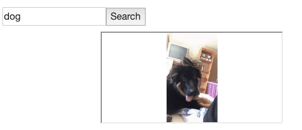

Alright, we've learned about AJAX - and what asynchronicity is -, touched on HTTP requests, and played around with **GET** requests. Now it's your turn.

  

----------

  

**Exercise 1**
-
  

Remember the fetch function from before? There we had the ISBN hard-coded on each call, which is not very useful.

  

Instead, add a parameter to the function that accepts an ISBN, and modify your function so that it searches for info about the book with _that_ ISBN.

  

For instance, if you call fetch(9780575087057), you should receive data about the best book in the world: _Name of the Wind_.

  

You can test your function with the following ISBNs, as well:

  

-   9782806269171 - _The Little Prince: Book Analysis_
-   1440633908 - _Of Mice and Men_ by John Steinbeck
-   9781945048470 - _The Alchemist_ by Paulo Coelho
-   9780307417138 - _Hitchhiker's Guide to the Galaxy_
- --------------

**Exercise 2**
-
Now modify your function again so that it receives two parameters: `queryType` and `queryValue`

  

You should modify your function to search by whatever `queryType` is (ISBN or title), with the value of whatever `queryValue` is.

  

For instance, if you call `fetch("title", "The Wise Man's Fears")`, you should receive data about the book _The Wise Man's Fears_.

  

You can test your function with the following, as well:

  

-   `fetch("isbn", 9789814561778)` - _From Third World to First: The Singapore Story_
-   `fetch("title", "How to Win Friends and Influence People")` - book by Dale Carnegie

----------------

**Exercise 3**
-
You will have noticed that the Google Books API returns its data in an `items` array - usually this array has data on more than one book.

  

Modify your `fetch` function again so that instead of printing the entire data that is returned from the API, you print the title, author, and ISBN [forEach](https://developer.mozilla.org/en-US/docs/Web/JavaScript/Reference/Global_Objects/Array/forEach) of the books in `items`

--------
**Exercise 4**
-
Often times, APIs will require an **API Key** - this is required to make sure that people don't spam their servers with requests.

  

Usually it's straightforward: in addition to the usual API URL and query string, you add another part to your request, something like this:

  

"http://something.com/bla/bla/search?q=some_query&api_key=YOUR_API_KEY"

  

You'll notice that we separate the `q` parameter and the `api_key` parameter with an `&` - **this is how we send multiple query strings**, when the API requires it.

  

The other important thing to notice is that it's pretty simple to send an API key (in many cases) - it's just another query string.

  

Using this knowledge, go ahead and [create a free GIPHY app](https://developers.giphy.com/dashboard/?create=true). Once you do that (it takes a few seconds), you should see your API key for using the GIPHY API. Go to [the dashboard](https://developers.giphy.com/dashboard/) if you don't see it automatically.

  

Once you have your API key, check out the [GIPHY docs](https://developers.giphy.com/docs/) (in particular, you can look at the **Code Examples** section) to figure out how to make a request for gifs about cats.

  

Once you get the data, **extract the first gif from your results, and use the** **`embed_url`** **property to display it on on a simple webpage**. Use the `iframe` tag - it works like an `img` tag, in that you can also give it a `src` attribute which accepts a URL.

-------------

**Exercise 5**
-
Continuing from **Exercise 4**, instead of making a hard-coded request for cats, add an `input` to your web page, with a simple button. When you press the button, you should get whatever is in the input, and use that to search for gifs using the GIPHY API. Display the first gif below the input box.

  

Ultimately, it should look something like this:

Congratulations, you've made a simple gif generator =]