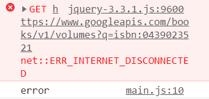

jQuery provides us with a more elaborate way to make requests. Instead of using `$.get`, we can also use `$.ajax`:

```js
$.ajax({
    method: "GET",
    url: 'https://www.googleapis.com/books/v1/volumes?q=isbn:0439023521',
    success: function(data) {
      console.log(data);
    }
  })
```
  

Though it's similar to the function we saw earlier, it's a lot to take in, so let's break it down. In its simplest form, it's just a function call: `$.ajax( )`!

  

The function, when called, takes an **object** as an argument.

  

This object defines some options for our function call. You can look at all of them [here](http://api.jquery.com/jquery.ajax/), but let's consider the ones we're using:

  

-   **method**: The HTTP method to use for the request (e.g. "GET", "POST", "PUT")

-   **url**: A string containing the URL to which the request is sent
-   **success**: A callback function to be called if the request succeeds

  

There is also an `error` parameter for when things go wrong - we'll add this later.

  

----------

  

**Spot check:**

Instead of using an **anonymous function** in the `success`, use a **named function** called useData instead.
See the solution [here](https://codepen.io/ElevationPen/pen/GbKyPa?editors=0010)

  

----------

  

As we said, there is effectively no difference in how you make your requests, but using `$.ajax` definitely gives you more granular control. Again, you can check out the other request options [here](http://api.jquery.com/jquery.ajax/), but a very important one is the `error` parameter:

  

```js
$.ajax({
    method: "GET",
    url: 'https://www.googleapis.com/books/v1/volumes?q=isbn:0439023521',
    success: function (data) {
        console.log(data);
    },
    error: function (xhr, text, error) {
        console.log(text);
    }
}); 
```
  

Unfortunately, not all requests make it to their destination and back. Sometimes we make mistakes, sometimes the server is down, sometimes the local apocalypse causes the internet to fail - due to this, we should practice **error handling** - which is exactly what it sounds like.

  

Using the `error` parameter we can know when our request fails, for whatever reason.

To see that in action, go ahead and **wrap the above code inside a function called fetch, then create a button that invokes that function**. This should be trivial ;)

  

If you need help, check [here](https://codepen.io/ElevationPen/pen/RzbxdO?editors=1010).

  

----------

  

Now, if you open that up in the browser and click the button, you should see the book data (in the console) as we saw before.

  

But now, **temporarily turn off your internet connection, then press the button again**. It might lag a little, but eventually you should see something like this:

  

  

The error in red is naught to worry about - it comes from the Google books API - but the second line, "error" - that's our `console.log`

  

Now, this error text in particular is not very descriptive. That said, it does alert us that there _is_ an error. Also, note that **in case of an error, the code inside the** **`success`** **callback will not execute** - it's sort of like an `if / else` in that sense.

  

If we only had a `success` parameter in our `ajax` method options, we couldn't know whether we've run into an error or not - which means the user might experience an endless loading screen or seemingly normal site, when in reality things aren't working.

  

Thus, **it is important to handle your errors; use that** **`error`** **parameter**.
