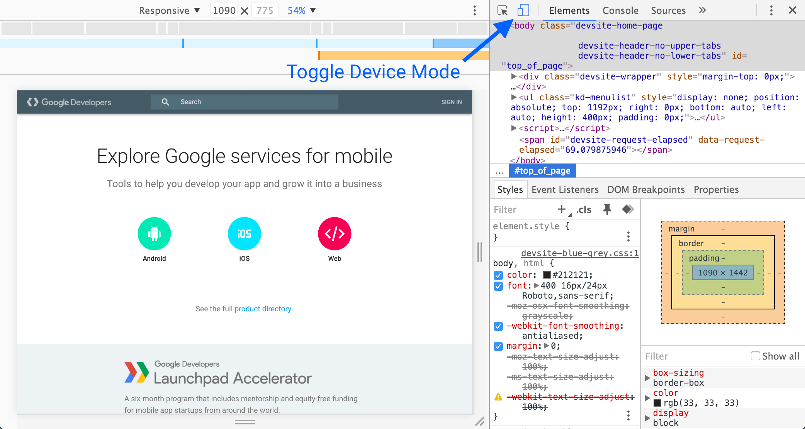

To see how our web-apps would look on different devices, you can use Chrome's built-in tool. See here:

  

  

You access that the same way you access the developer tools (either by inspecting the page, or some shortcut you like)

  

This is a very handy tool when you're optimizing you app for mobile-use!

  

  

----------

  

  

#### **DONE**

  

No explicit exercises for this one - just some good tools to be aware of! Practice using them in future projects ;)
