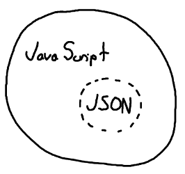

JSON stands for JavaScript Object Notation, and looks like this:


```
{
  "hello": "world"
}
```

This should all look familiar. Maybe a little bit too familiar...


That's a good thing!


JSON, happily enough, was directly inspired by JavaScript's syntax for creating objects! It's what you'd call a proper subset of JavaScript. It is made up of some, but not all, of JavaScript's syntax and data structures.


This means that all JSON is valid JavaScript, but not all JavaScript is valid JSON.





In general, we use JSON to store and share data temporarily between different entities (clients, servers). We say temporarily because we don't actually use JSON as a database to persistently store data, but rather as a language-agnostic data structure.  Let's find out what that means.

  

----------

  

#### **LANGUAGE INDEPENDENCE**

  

Read the first few paragraphs found on [http://json.org](http://json.org/), up to the point where the diagrams start (it's short).

  

The main takeaway about JSON you should understand is that it is **language-agnostic**, i.e not dependent on any particular programming language.

  

That is, whether you code in JS, Python, C++, or Go, you can always read/write/communicate with JSON.

  

In fact, JSON makes communicating between computers easy in a number of ways:

  

1.  So long as two different programming languages generate (write) and consume (read) JSON, they can send data between one another
2.  If you build an app with both a client-side and server-side, they don't have to be the same language
a.  So long as the server serves some JSON, and the client expects to read some JSON, all will be well
b.  This is particularly useful if you want to break your server up to take advantage of certain features in other languages
3.  Virtually all programming languages use the same data structures represented in JSON
a.  Arrays (also known as lists), Objects (a.k.a hashes, dictionaries, maps, etc). Numbers, Strings, Booleans
b.  Sharing common data structures makes it simple to share and manipulate data between clients and servers

  

Imagine a French man and a Portuguese woman writing perfectly innocent letters to one another. Neither knows the other's language, but they both dictate to an English speaker who speaks their own language.

  

In this case, English is JSON because both the Portuguese and the French can communicate with it (i.e language-independence). So it doesn't matter that the man and woman speak different languages, they can still send and receive information from one another with English!