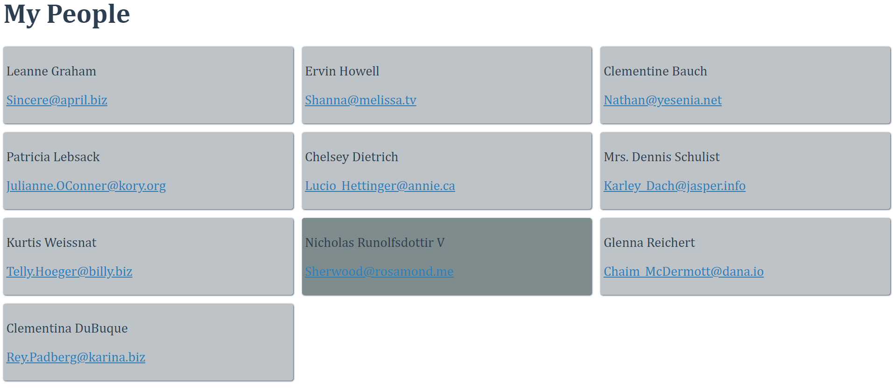

# Intro

  

Knowing both Handlebars and how to make simple GET requests is great - both are very powerful tools.

  

Let's take advantage of these and create a simple (static) directory of people, with a bit of CSS Grid for flare.