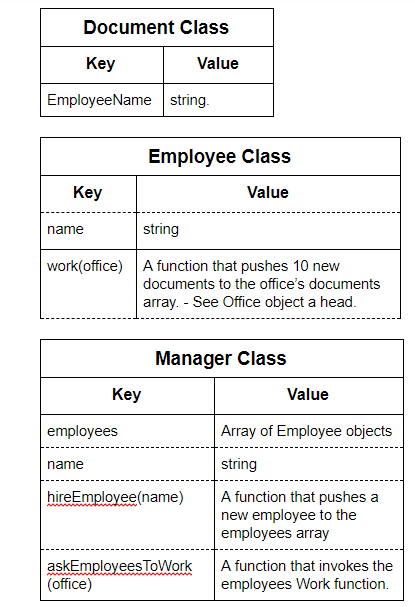
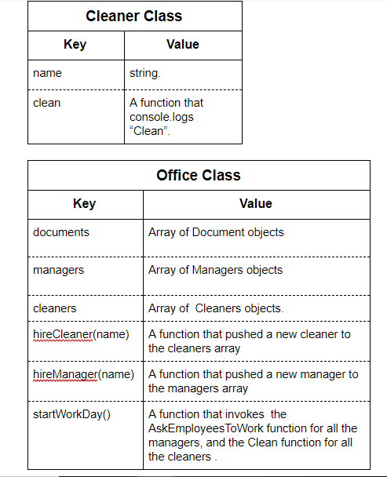

##   
OOP Office Exercise

Mark as done

To get your hands dirty with OOP, you're going to create an office setup based off of the UMLs below.

  

To get started, fork [this repository](https://github.com/Elevationacademy/OfficeChallenge/).

  

You will create your classes in the `main.js` file (it is currently empty), and you can check that you're doing it right by using the Jasmine Tests we've created for you - you don't need to understand testing to use this.

  

Before you write any code, open up `SpecRunner.html` (from the repo you forked) in the browser. You should see this:

```js
18 specs, 18 failures
Spec List | Failures
Document class should create an object with an attribute called - EmployeeName and it should be initialized in the constructor
Expected undefined to equal 'elevation'.
Error: Expected undefined to equal 'elevation'.
    at stack (file:///C:/Users/Jona/Desktop/OfficeChallenge/lib/jasmine-2.3.4/jasmine.js:1482:17)
    at buildExpectationResult (file:///C:/Users/Jona/Desktop/OfficeChallenge/lib/jasmine-2.3.4/jasmine.js:1452:14)
    at Spec.expectationResultFactory (file:///C:/Users/Jona/Desktop/OfficeChallenge/l

etc...
```
If you read the main error, all it's saying is that there should be a `Document` class, and it should have an `EmployeeName` attribute initialized in its constructor - as required by the UML diagram (below).


  

Once you write the class, you'll see `17 failures` instead of `18` at the top. Your goal is to get to 0 failures =]

  

Notice that **you don't have to instantiate any objects yourself**. You just need to create the classes - the tests will run and check everything for you!

  

**Attention:** be very precise - spelling and casing are important! Your tests will fail if you create a `Docment` class instead of `Document`

  

So without further ado, here are your UMLs. Let's make an office - good luck!

  





----------

####   

#### **new DONE( )**

And that's a wrap. OOP is very cool and very popular. Make sure you're using it henceforth ~
