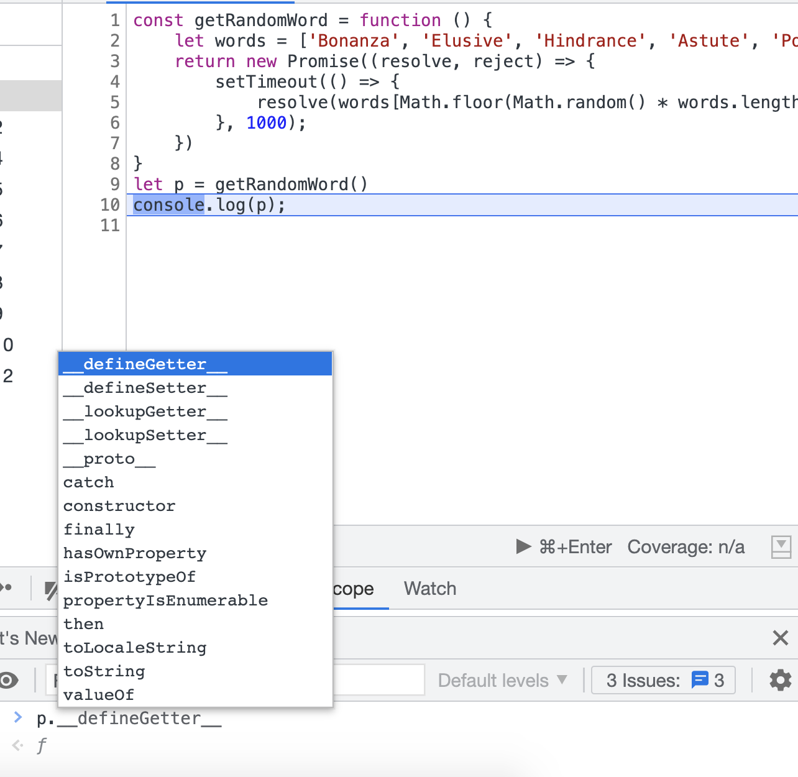

In order to solve the callback hell problem, some async functions return a `Promise`.

Assuming that our `getRandomWord` returns a promise (we will see the implementation later) the code for calling it and printing the word will look like this:
```js
getRandomWord()
    .then((word) => {
        console.log(word);
    })
```

first we call `getRandomWord` and **then** (haha 😄) the callback that prints the word will be invoked.
  
Note that the async function now returns a `promise` which is a special object.
It has a few important properties:
* then
* catch
* finally



Each of these is a function that receives a callback.
The callbacks will be invoked according to the state of the promise.

The promise has 3 states:
1. **Pending** - meaning that the async operation did not finish yet, and it is still in progress.
1. **Fulfilled**: meaning that the operation was completed successfully
1. **Rejected** - meaning that the operation failed.

When the promise is created it is by default pending.
If the async operation completed successfully the state will change to Fulfilled, otherwise if the operation failed the state will change to Rejected.

According to the completion state the relevant callback will be invoked.
In case the state changed to **Fulfilled** => the **then** callback will be invoked
In case the state changed to **Rejected** => the **catch** callback will be invoked
The **Finally** callback will be invoked in either way, whether it was Fulfilled or Rejected.

A full example will look like this:
```
makeAsyncOperation()
    .then((result) => {
        console.log("promise completed successfully");
    })
    .catch((error) => {
        console.log("promise failed");
    })
    .finally(() => {
        console.log("will be printed any way");
    })
```

This is what a "promise" means - **the value of what** `getRandomWord()` **returns is not the actual data we want** - it is a **promise** that will **eventually** return the data we want. Before it's complete, its status is "pending" - i.e. waiting for a result.


|||important
## Resolved

Another term that is important to understand is **resolve**.
A **resolved promise** is a promise that is not pending. The operation is completed successfully or not.
|||


To extract the data, we need to use the `.then` method:

```
let randomWordPromise = getRandomWord()


randomWordPromise.then((word) => {
        console.log(word);
    })
```
The data parameter that the async operation returns will be passed to the callback.

We still need a **callback**, but at least we can separate it now.

Of course, we don't have to store it in an external variable. We can **chain** the `then` directly to the call, and still have it on a separate line - like we do with array methods.

```js
getRandomWord()
    .then((word) => {
        console.log(word);
    })
```
