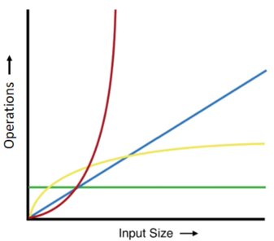

## Exercise 1
        
What is the complexity of the following code?
        
```
const getBalance = function (bankOperations) {
  let balance = 0
  for (let op of bankOperations) {
    balance += op
   }
   return balance
}
    
getBalance([-27, -43, -2400, -700, 15000, 58])
```
    
## Exercise 2
   
What is the time complexity of the following code?
    
```
const printSome = function (complaints) {
  for (let i = 1; i < complaints.length; i = i * 2)
    console.log(complaints[i].text);
}
```
    
## Exercise 3
    
What is the complexity of the getHyp function?

```
const allSides = [
  { a: 3, b: 4 },
  { a: 15, b: 21 },
  { a: 41, b: 8 },
  { a: 12, b: 6 }
]
    
const relevantSides = allSides.filter(s => s.a % 3 == 0)
for (let sides of relevantSides) {
  console.log(getHype(sides))
}
    
const getHype = function (sides) {
  let a = sides.a
  let b = sides.b
  let sumOfSquares = a * a + b * b
  return Math.sqrt(sumOfSquares)
}
```

## Exercise 4

Take this one **slowly**. What is the complexity of the `getDistributions` function?
    
```
const studentAnswers = {
  brBlds: {
    1: "a",
    2: "a",
    3: "c"
  },
  dvOna: {
    1: "a",
    2: "c",
    3: "c"
  },
  nmPrz: {
    1: "a",
    2: "b",
    3: "a"
  }
}
const studentGithubs = ["brBlds", "dvOna", "nmPrz"]
    
const distributions = {
  1: {},
  2: {},
  3: {}
}
    
const getDistributions = function (studentAnswers) {
  studentGithubs.forEach(sg => {
    let answers = studentAnswers[sg]
    
    Object.keys(answers).forEach(questionNumber => {
      let letterAnswer = answers[questionNumber]
    
      distributions[questionNumber][letterAnswer] ?
        distributions[questionNumber][letterAnswer]++ :
        distributions[questionNumber][letterAnswer] = 1
    })
  })
    
  return distributions
}
    
getDistributions(studentAnswers)
```
    
## Exercise 5

What is the complexity of the emailManager function?

```
const sendEmails = (email, recepients) => recepients.forEach(r => r.sendEmail(email))
    
const emailManager = function () {
  let email = generateEmail()
    
  $.get('/recepients', function (recepients) {
      sendEmails(email, recepients)
  })
}
    
```
    
      
    
Check your answers for exercises 1-5 with these [solutions](https://codepen.io/ElevationPen/pen/dBpoeG?editors=1000). If you got something wrong, review it, try to understand, and if you're still confused, ask someone to explain it to you - it's important!

    
## Exercise 6
    
Earlier in this lesson, we saw a solution to the `findDuplicates(arr)` function that ran in **O( n2 )**, which is pretty awful.
    
      
    
Write a different implementation of `findDuplicates(arr)` that runs in **O( n )**.
    
      
    
It should print "there is a duplicate" if there are _any_ duplicates in the array `arr`
    
      
    

<details><summary>
  Click here to reveal a hint.
</summary>
You should use an object to track which numbers you've already seen in arr.
</details>

---

**The questions below are a little more challenging**

---

## Exercise 7
    
You are given the following spreadsheet data about your employees:

```
    _id     |name   |age    |salary
    --------------------------------
    ax01    |Ray    |28     |1300
    qs84    |Lucius |31     |840
    bg33    |Taylor |18     |2700
```

      
    
In reality, you have 320,000 employees, and you need to be able to find the salary of any employee very fast.
    
      
    
You need to **decide how you're going to store this data**, such that the function `findEmployeeSalary(employeeID)` runs in **O( 1 )** - constant time.
    
      
    
Then, of course, write the `findEmployeeSalary(employeeID)` function.

    
## Exercise 8
    
Earlier in this lesson we discussed what a **binary search** is and how we can use it to find something in a sorted array in **O( log(n) )** time.
    
      
    
Using the visuals and explanations from earlier, **write a** `findIndex(numbers, num)`**function** that finds the index of `num` in the given `numbers` array in **O( log(n) )**.
    
      
    
Use the following sorted array to determine what the index of the number `2630` is - you should find it to be `86`:
    
```
let numbers = [24, 33, 66, 102, 108, 140, 146, 177, 182, 217, 341, 357, 372, 390, 418, 427, 442, 444, 469, 480, 572, 624, 627, 665, 680, 694, 743, 768, 790, 794, 852, 896, 919, 942, 982, 991, 1026, 1055, 1086, 1137, 1141, 1157, 1167, 1271, 1272, 1273, 1301, 1337, 1340, 1344, 1388, 1455, 1465, 1466, 1509, 1555, 1640, 1667, 1667, 1689, 1824, 1897, 1928, 1950, 1987, 2056, 2059, 2070, 2123, 2140, 2198, 2215, 2260, 2304, 2383, 2403, 2433, 2454, 2472, 2480, 2481, 2535, 2543, 2554, 2557, 2580, 2630, 2634, 2671, 2745, 2792, 2839, 2849, 2871, 2873, 2893, 2932, 2962, 2984, 2987]
```
    
## Exercise 9
    
Without looking at the image at the beginning of this lesson, determine which of these graphs belongs to which of the following operations:
    
-   **O( 1 )**
-   **O( log(n) )**
-   **O( n )**
-   **O( n2 )**
    

    
----------
    
      
    
#### **O( done )**
    
      
    
But you're not really done, because for the rest of your life now, you will consider the complexity of any algorithm, anywhere, and think about how you could improve it.
    
That is how the mind of a programmer works.