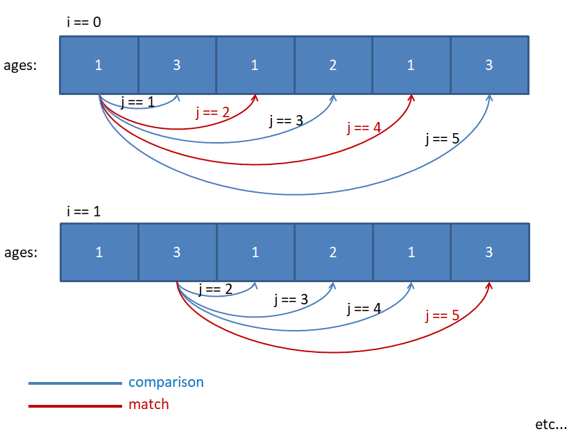
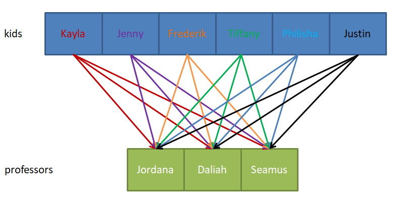

This section is a little mind-blowing if you're very new to this kind of thinking, so **take it slow**.

  

Take a look at this code. Think about it for a couple of minutes:

```
const findDuplicates = function (ages) {
    for (let i = 0; i < ages.length; i++) {

        for (let j = i + 1; j < ages.length; j++) {
            if (ages[i] === ages[j]) {
                console.log(`${ages[i]} has a duplicate`)
            }
        }
        //note that this *entire* inner loop runs for each iteration of i
    }
}
```
  

Here we're looking for duplicates. To do that, we're looking at each number in the `ages` array, and comparing to each number _after_ it (that's what the `j = i + 1` is for).

  

Visually, that looks like this:



In other words:

-   Start with the first number in the array (number 1 at index 0)
-   Compare 1 to all the numbers after it (number 3 at index 1, number 1 at index 2, etc)
    -   Console log each time there's a match
-   Go to the next number in the array (3)
-   Compare 3 to all the numbers after it (1, 2, 1, 3)
-   Repeat until the end

  

In terms of time complexity, we can think of it likes this:

-   We are iterating over _each_ value of `ages` (using `i`) - this is **O( n )**
-   Then,
    -   For the first value of `i`, we iterate over all of `ages` _except_ the first item - we do this with `j`
    -   For the second `i` we iterate over all of `ages` except for the first two items
    -   etc
-   As such, the _total_ number of times we iterate with `j` is `(n - 1) + (n - 2) + (n - 3) + (n - 4) + (n - 5) = 5n - 15`
-   The _average_ number of operations _for each_ iteration of `i` is `(5n - 15) / 5`, which is just n - 3
    -   And of course, because we ignore constants, the average number of operations with `j` is also **n**

  

Therefore, because we have **O( n )** _for each_ `i`, and we have - on average - **O( n )** _for each_ `j` (remember that all the `j` iterations happen for each `i`), then in this case we will **multiply the complexities**:

  

**n × n = n****2** - and as such, the time complexity for the above is **O( n****2** **)** - _O of n squared_. This is also known as **quadratic time**.

  

It may have seemed like a process to get to this conclusion, but **generally, double for loops have a time complexity of O( n****2** **) - but not always.**

  

The implications of this complexity are quite bad. It means that **as our input grows, the number of operations grows <ins>exponentially</ins>** - this is one of the worst efficiencies you can achieve.

  

----------

  

Even though generally double for loops lead to **O( n****2** **)** complexity, it's not always the case.

Take a look at this code, for instance:

```
let professors = ["Jordana", "Daliah", "Seamus"]

const greetProfessors = function (kids) {
    for (let kid of kids) {

        for (let p of professors) {
            console.log(`${kid} greets Professor ${p}`)
        }
    }
}
```
  

In this case, our number of operations still depends on the number of `kids` - we are looping _for each_ kid - so we're at least at **O( n )**.

  

However, in this case the second array - `professors` - is static. In other words, the number of iterations we have _for each_ professor stays _the same_ no matter how long/short the `kids` array is.

  

So we can say that the complexity of running through the `professors` array is **O( m )** - where **m** is the length of `professors`. But, because we are iterating over the entirety of `professors` _for each_ kid, then we have to multiply our complexities:

**m × n = mn** - and as such, the time complexity for the above is **O( mn )** - _O of mn_.

  

Notice that in this case **m** is **not** a constant! Even though the length of `professors` doesn't change (for now), **m** is not an arbitrary number - it represents some part of our **algorithm** that we need to take into account.

  

Visually, you can imagine it like this:



Here, _each_ kid has to go over _each_ professor - but the length of `professors` is fixed, so if our `kids` array increases in size, it has no effect on `professors`.