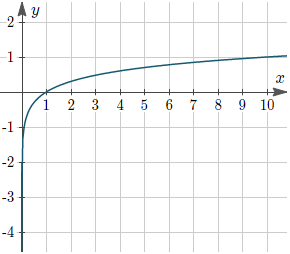

There is one more important notation we need to understand, but first we need a brief, _brief_ review of **logarithms**.

  

----------

  

**Logarithms Review**

  

There are a few things that are important to understand about logarithms:

1.  Generally, when we talk about logarithms, we mean a logarithm with a base of 10: **log10( x )**
    - Because base 10 is so common, we usually understand **log( x )** to be the same as **log10( x )**
2.  For the mathematical function `y = log( x )`, we can calculate `y` by saying `10^y = x`
    -  `10` is the base of the logarithm
    - For instance, if we have the function `y = log(100)`, we can say that `10^y = 100`
    - We know intuitively that `10^2 = 100`, therefore in this case `y = 2`
    - Likewise, if we have `y = log(1000)`, we can determine simply that `y = 3` because `10^3 = 1000`
3.  From the above we understand that **logarithms are the inverse of exponents**

    -   In the function `y = x^2`, as the value of `x` grows, the value of y will grow _exponentially_, which is very fast
    -   But in the function `y = log(x)`, as the value of `x` grows, the value of `y` grows _logarithmically_, which is very slow
    -   Think about it: in the log function above,
        -   When `x = 100`, the value of `y` was `2`
        -   And when `x = 1000`, the value of `y` was `3` - it only went up by `1` even though we increased `x` by an order of magnitude

  

Given the above, we can graph a **logarithmic function** like so:

  

We see how the graph grows quite slowly. Between the `x` values of `1` and `10`, the `y` value doesn't even reach `1`. `10^10`

## Spot check
What is the log of one million?

  Click here to reveal the answer.

  It's `6`.

We can rewrite the question like this: `y = log(1,000,000)` - what is `y`?

Since `10^6 = 1,000,000`, then `y = 6`

---

That's it for our logarithms review - back to time complexity!