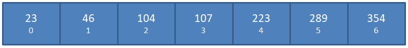
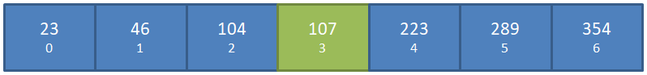
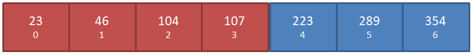
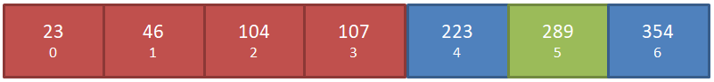
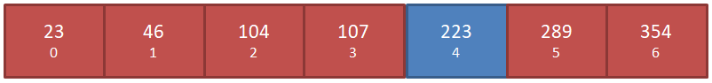

But we can do it more efficiently. We can take advantage of the fact that the array is **sorted** in order to find the index of `2630` _much_ faster.

  

In the following visualization we have a smaller array, and we are **looking for the index of the number 223**:

  

Because this array is sorted, we can start by going to the middle of the array (index 3), and then we know for certain that _anything to the right will be_ **_bigger_**_, and anything to the left will be_ **_smaller_** of whatever is at index 3:

  

  

Because we are looking for the index of the number **223**, and we know that `223 > 107`, then we can ignore the entire left side of the array now, and only look to the right:

  

  

Now we can repeat the above process, but only for the right side of the array. We start by finding the middle:

  

And since `223 < 289`, we can ignore the entire right side of this sub-array now:

  

If the array were any longer, we would keep repeating this process - but now our sub-array only has one element left - which happens to be **223** - exactly what we were looking for!

  

Our operations at each stage were:

-   Go to the middle - **O( 1 )**
-   Determine if bigger or smaller - **O( 1 )**
-   Change upper/lower bounds - **O( 1 )**
-   Go to the middle - **O( 1 )**
-   Repeat

  

Of course, the size of the array _does_ matter, so the actual complexity of this is _not_ **O( 1 )** - but the process we just went through is called a **binary search**.

  

In binary search, **each iteration cuts the remaining input size by half** - just as with the array above where we always went to the _middle_ of the sub-array, then ignored an entire half of it.

  

Believe it or not, _the time complexity for a binary search is_ **O( log(n) )** - yes, the very same **log(n)** we talked about before.

  

This means that given an input of length **n**, we can complete all our work in **log(n)**operations.

  

To prove it, say we had a _sorted_ array with the numbers 1-100, and we wanted to find the number 51:

  

1.  `[1, 2, 3, ..., 100]`
2.  Go to middle: `[1, 2, 3, ... **50**, ..., 100]`
3.  Looking for `51`, so ignore left side and we are left with: `[51, 52, 53, ... 100]`
4.  Go to middle: `[51, 52, 53, ... **75**, 100]`
5.  Looking for `51`, so ignore right side and we are left with: `[51, 52, 53, ... 75]`
6.  Go to middle: `[51, 52, 53, ... **63**, ..., 75]`
7.  Looking for `51`, so ignore right side and we are left with: `[51, 52, 53, ... 63]`
8.  Go to middle: `[51, 52, 53, ... **57**, ..., 63]`
9.  Looking for `51`, so ignore right side and we are left with: `[51, 52, 53, 54, 55, 56, 57]`
10.  Go to middle: `[51, 52, 53, **54**, 55, 56, 57]`
11.  Looking for `51`, so ignore right side and we are left with: `[51, 52, 53]`
12.  Go to middle: `[51, **52**, 53]`
13.  Looking for `51`, so ignore right side and we are left with: `[51]`
14.  **Done**

  

So even though our input was an array with **100** numbers, it only took **12** operations to find the number we were looking for!

  

That's **log(n)** operations, i.e. a complexity of **O( log(n) )** - _way better_ than our naive solution before which was **O( n )**.

  

Binary search is one of the most known search **algorithms** out there - **every developer should understand this concept**.

## Spot check
Which is better, **O( 1 )**, or **O( log(n) )**?

  Click here to reveal the answer.

  
**O( 1 )** is the best complexity we can achieve. Ever. It literarly means that there is a **constant**number of operations required, _no matter what the input size is_.

  

