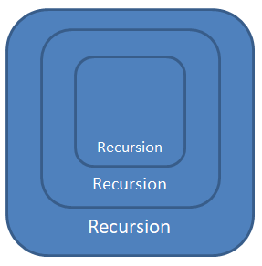

  

In this lesson we're going to go over **recursion**. Recursion is **a way to solve problems** (like loops are a way to solve problems).

  

The difference is that **with recursion we don't iterate**, but rather we have a function call itself **recursively** until some problem is complete.

  

An important note is that **we never have to use recursion**, but sometimes it makes sense to.

  

Let's consider the following problem: _how can we sum the numbers in the following array?_

  
```
let numbers = [3, 7, 20, 1, 1, 8, 2]
```
  

We can do this both with a loop (iteration), and with recursion.

  

Here's a simple loop solution:


```
const sum = function (numbers) {
  let sum = 0
  for (let num of numbers) {
    sum += num
  }
  
  return sum
}

sum(numbers)
```
  

And there's nothing wrong with that solution, but let's look at a different approach.
