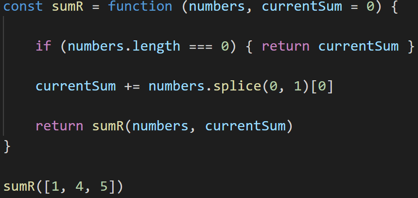
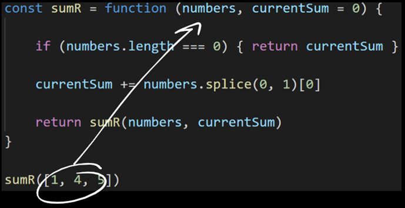
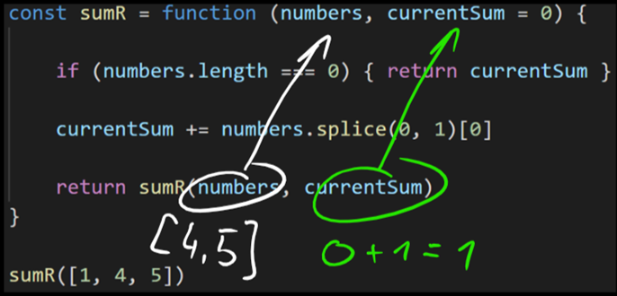
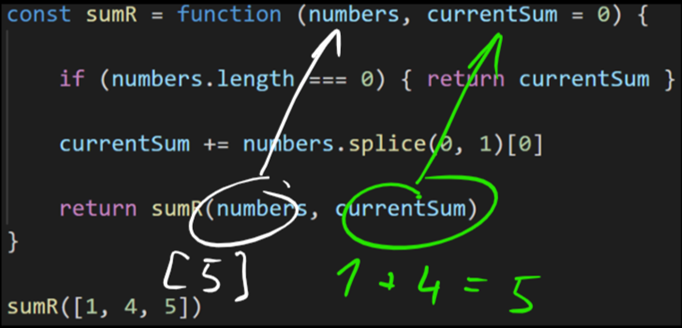
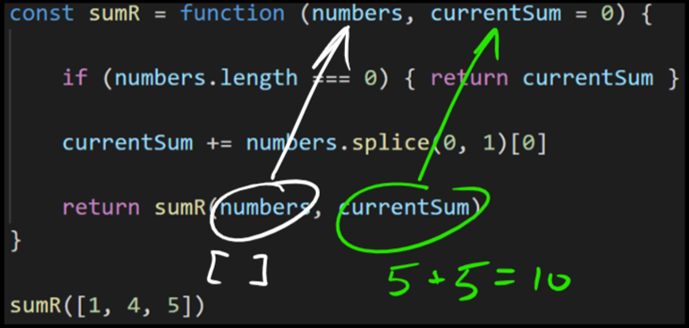
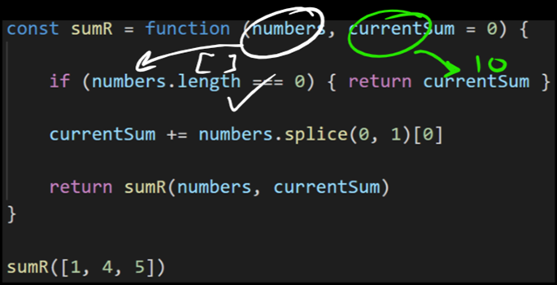
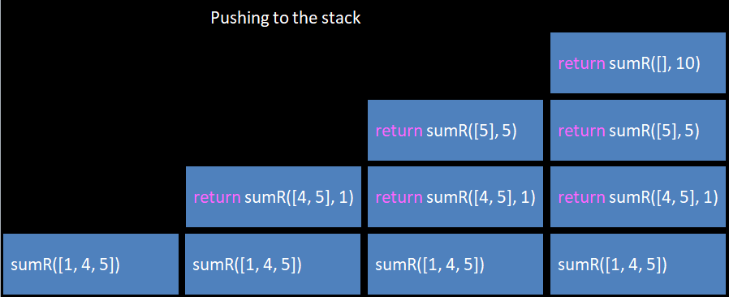
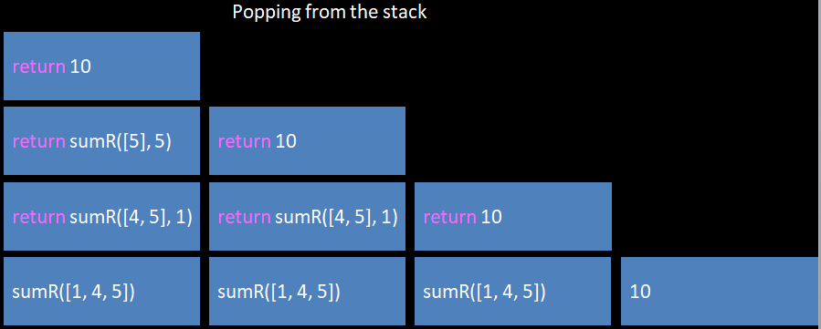

```
const sumR = function (numbers, currentSum = 0) {
    if (numbers.length === 0) { return currentSum }

    currentSum += numbers.splice(0, 1)[0]
    return sumR(numbers, currentSum)
}

sumR(numbers)
```
  

Let's break this down from top to bottom:

-   Our function signature has changed - now instead of just getting `numbers`, we also receive `currentSum`
    -   We'll see what `currentSum` is for in a second - but notice its **default value** of `0`
-   The first thing we do in recursion is determine some **stopping condition**
    -   This condition is also known as the **base case**, and should return some value
    -   Note that **every recursive function must have a base case** or it will never end
-   Next, we increment `currentSum` by `numbers.splice(0, 1)[0]` - let's break this one down:
    -   `numbers.splice(0, 1)` - removes the first item from `numbers`, and returns an array of all the removed numbers
    -   We follow up with `[0]` to get the first (only) number that was removed
-   Finally, we have our actual recursion: we **invoke** **`sumR`** **again**
    -   In this invocation, we're passing the updated `numbers` array (which is shorter now) and the updated `currentSum`

  

Because we've invoked `sumR`, we're starting the whole process from above again, **including the check of our base case** - so as soon as our `numbers.length` is `0`, we will stop recursing.

  

Let's step through this visually. Here is our starter:

  



  

The first thing that happens is the normal `sumR` invocation from outside of the function:

  



  

Note that there is no need to pass the second parameter, `currentSum`, as it has a default value of `0`

Next, since `numbers.length` is not `0`, we:

-   Do our `splice` work
-   Then invoke `sumR` again from within the function

  



  

Notice that **we have to** **`return`** **the inner** **`sumR`** **call** - if we didn't, then none of this would work because **functions return** **`undefined`** **by default.**

  

This is important because the _actual_ `return` we care about is the `return currentSum` - but we won't ever get to `return` that if we don't return the function result that made _that_ possible.

  

Let's continue with the visualization to see what that means:

  



  

Our **base case** is still not valid, so we do the same work as before but with different values. And again:

  



  

Now notice that we don't have anything left inside of `numbers`, as such the next step _will_ trigger our **base case**:

  



  

Now _this_ `return` statement returns `currentSum` to the _previous_ function call (the last recursive invocation of `sumR`), which returns it to the _previous_, which returns it to the _previous_, **etc**, until we reach the origin invocation of `sumR([1, 4, 5])` from outside the function.

  

To visualize that, here is a representation of the callstack over time:

  



  

Above we see each successive recursive call being added to the stack.

  



  

And now we see each stack frame being popped off - this only starts to happen once the `numbers` array has a length of `0`

  

Notice that ultimately we are returning an actual value (the `currentSum`, `10`) - but we only have that value once each `sumR` from the higher level in the stack is popped.

  

----------

  

#### **WHEN TO USE RECURSION**

  

As we noted earlier, you **never have to** use recursion. In the previous example, it was probably easier, more intuitive, and clearer to use a simple for loop.

  

But in some cases, as when working with [certain data structures](https://en.wikipedia.org/wiki/Tree_(data_structure)), it will make more sense to use recursion.