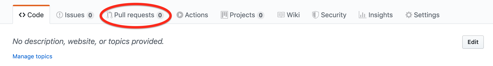
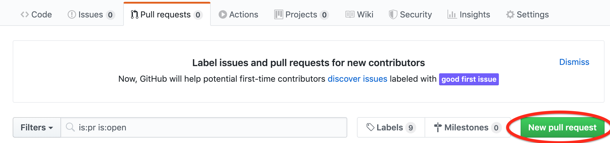
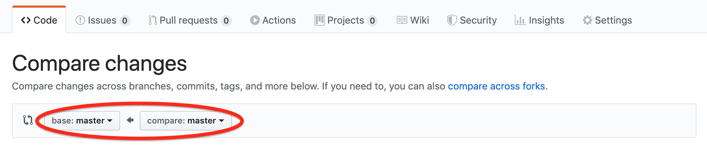

In order for us to review your code, you’ll need to complete the following steps.

  

1.  Download and install NodeJS, you can do so [here](https://nodejs.org/en/download/). Don't worry about what Node is (we'll learn about it eventually).
2.  Once you have Node, go to the root directory of your project (in the terminal) and run npm init and click enter several times until you get back to the command line (you shouldn't be worried about what it does right now)
3.  Then run npm i elevation-pr
4.  Please note the following before continuing to the next steps
a.  Make sure the folder is already a git repo
b.  Make sure it already has a commit (ideally you should have quite a few commits if you were committing correctly)
c.  Make sure it’s linked to a remote repo on Github
5.  Run npm run review in the terminal
6.  Go to Github and click Pull Requests

  

  

Then click New Pull Request

  

  

  

Now, set the base to be review (you can change this through the drop down), and the compare should be set to master (should be set to that by default)

  

  

You will be able to click the green button "create pull request".

Don't forget to add a title and press the "create pull request" button again

  

That's it. Copy the link to the repo and submit it with [this form](https://docs.google.com/forms/d/e/1FAIpQLSc0BJtMVATSc83zYCKwnfZX-jHQ6x_A10grsQAXy6nWCVWVOw/viewform).