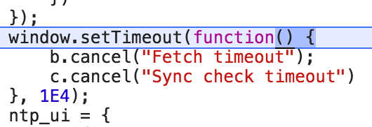

**_Main point_**_: In the browser environment, Javascript utilizes other tools and functions provided by additional API's (like_ _`setTimeout`__) . Functions from those API's are_ _`not`_ _added to the callstack like other functions that we might declare, but are instead inserted into a "task queue". Only when the callstack is clear will the event loop take something from the task queue and add it to the stack. This is why "asynchronous callbacks" run later - they're not blocking the callstack because they're hanging out in the task queue._

  

Our above example of using `setTimeout` is an example of the "task queue" and "event loop" in action. When our Javascript interpreter encounters an asynchronous function (such as `setTimeout`), it doesn't place it on the Call Stack - that would block our Call Stack - instead, it places it in the "task queue". Then, our "event loop" looks for the Call Stack to clear, and when it does, it then takes whatever is next in our "task queue" and adds it to the Call Stack.

Copy/paste the following example in your console:

  

```js
debugger;

function firstFunc () {
  function asyncCallback () {
    console.log("I will wait, but I won't block!");}

  setTimeout(asyncCallback, 3000);
  }
};
function secondFunc () {
  console.log('Then I can go');
};

firstFunc();
secondFunc();
```
  

This is much like our previous examples, but we named our asynchronous callback function (`asyncCallback`), so that we could see it in the Call Stack. Play with this using your Chrome Dev tools. If you pay close enough attention, you will see that eventually our browser will reference `setTimeout` from deep in the core of our browser:

  




  

Then, in the end, `asyncCallback` will magically appear on the Call Stack (thanks to the "event loop" and the "task queue".

  

----------

  

Can you think of another example of when we have used a Web API to get async behaviour?

  

  
<details><summary>  
Click here to reveal the answer.  
</summary>
jQuery's ajax method! The documentation says that it "performs an asynchronous HTTP (Ajax) request" The "Success" and "Error" functions are put on the task queue and run only when there is a response and the call stack is empty!
</details>
