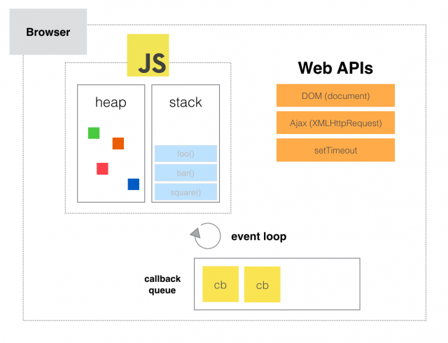

Hopefully, you've already watched the below video (if not then try to watch it before you move on).

  

Today, we're going to review some of the main points in Phillip Roberts' talk on async Javascript. We'll copy/paste our own examples to demonstrate the concepts he presented and ask a few quiz questions along the way to see what you picked up.

  

