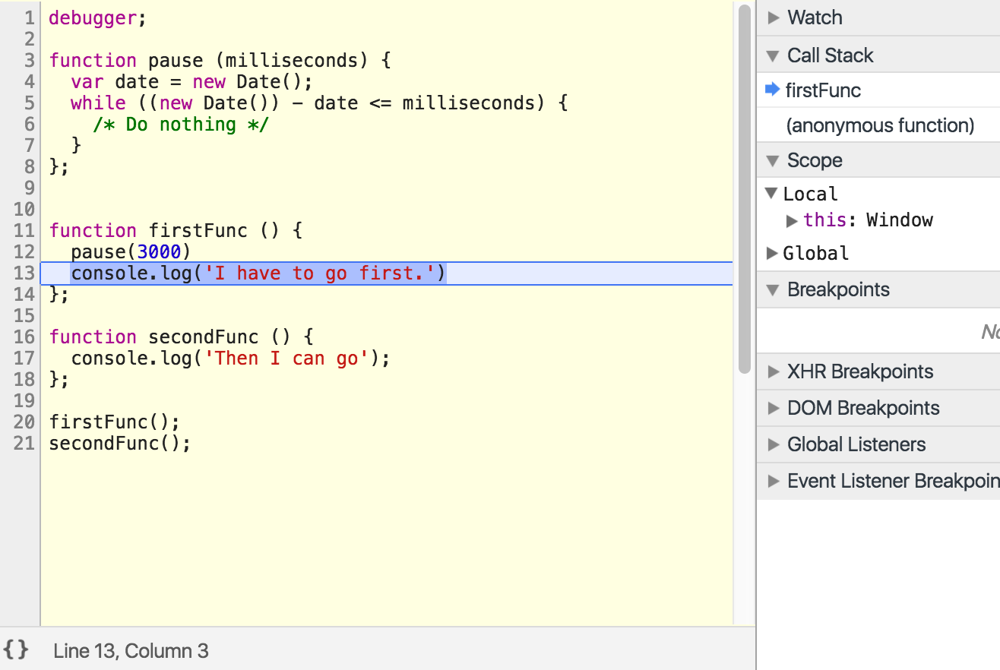
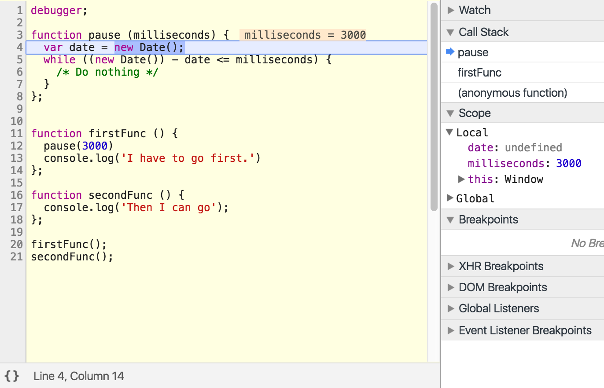
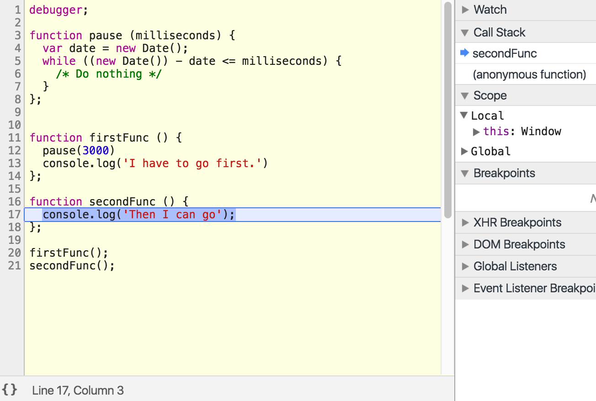
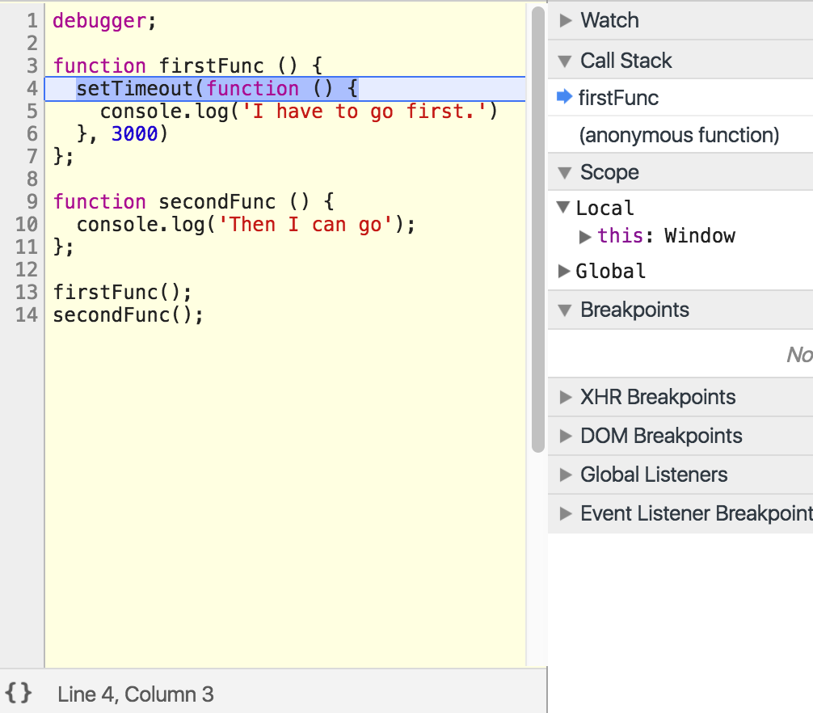
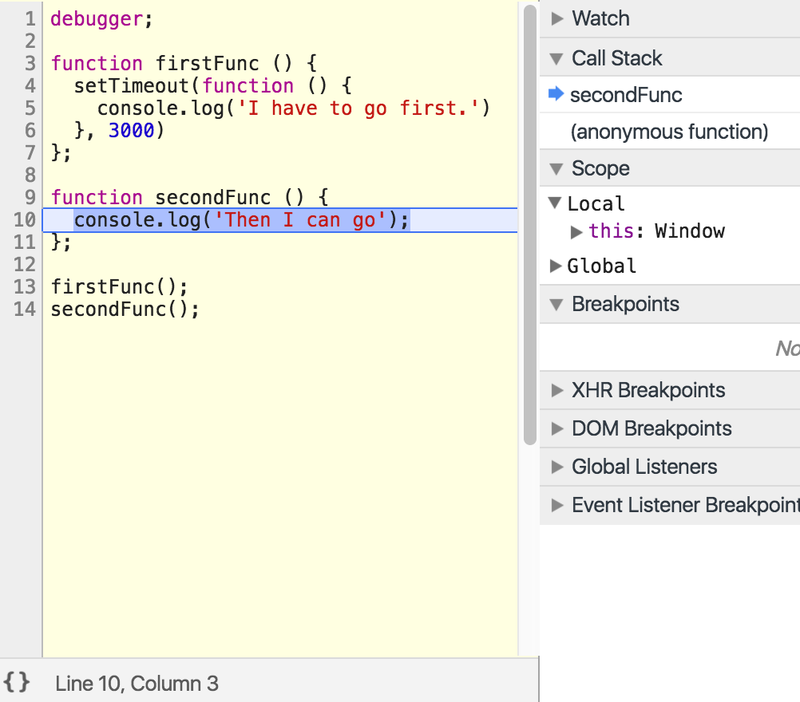

# Asynchronous Callbacks

**_Main point:_** _A callback is just a function that is passed into another function to be called later (we already know that). An "asynchronous callback" is a callback function that is called later, but does not block the Call Stack, and therefore allows other functions to keep being added and returned off the Call Stack as it waits to be executed. In other words, they seem to violate the rules of the Call Stack. We'll find out in a moment how this is handled._

  

Let's look at an example of an asynchronous callback. Copy/paste the following into your console. Notice that `setTimeout` takes an anonymous callback function. This function will be invoked "asynchronously".

  

```js
function firstFunc () {
  setTimeout(function () {
    console.log('I have to go first.')
  }, 3000)
};

function secondFunc () {
  console.log('Then I can go');
};

firstFunc();
secondFunc();
```
  

This example is very similar to the example we gave in the **Blocking** section. However, this time, we replaced the `pause` function with `setTimeout`.

  

One might expect that the result here would be the same - `'I have to go first.'` would log, then (3 seconds later) l, `'Then I can go'` would be logged. However, as you see, `firstFunc` is not blocking `secondFunc` from running. That must mean that `setTimeout` is being added to the callstack with a delay, unlike `pause`, which was added to the callstack (and prevented `firstFunc` from returning). Let's break down each example:

  

**_Blocking Example Using_** **_`pause`_**

  

1. `firstFunc` is added to the Call Stack.

  



  

2. `pause` is added to the callstack. Now `firstFunc` will not be able to run until `pause` is finished and taken off the Call Stack.

  




  

3. Finally `pause` is finished and taken off the Call Stack (after 3 seconds), then `firstFunc` is finished and taken off the Call Stack, then allowing `secondFunc` to be placed on the Call Stack.

  



  

**_Non-blocking (asynchronous) Example Using_** **_`setTimeout`_**

  

1. Just like in our previous example, `firstFunc` is added to the Call Stack.

  


  

2. Then, `firstFunc` finishes (even though the console log hasn't happened yet) and is taken off the Call Stack. This allows `secondFunc` to be placed on the Call Stack and execute. Unlike `pause`, `setTimout` is never added to the Call Stack, yet it still runs after 3 seconds. So what did our Javascript Interpreter do with `setTimeout`?

  



What we need to understand is that setTimeOut registers inside the call stack, however it passes its delay to be reigstered to the webAPI (the browser)

then the browser deals with the delay and passes on the callback back to the javascript event loop to run the callback in its callback queue