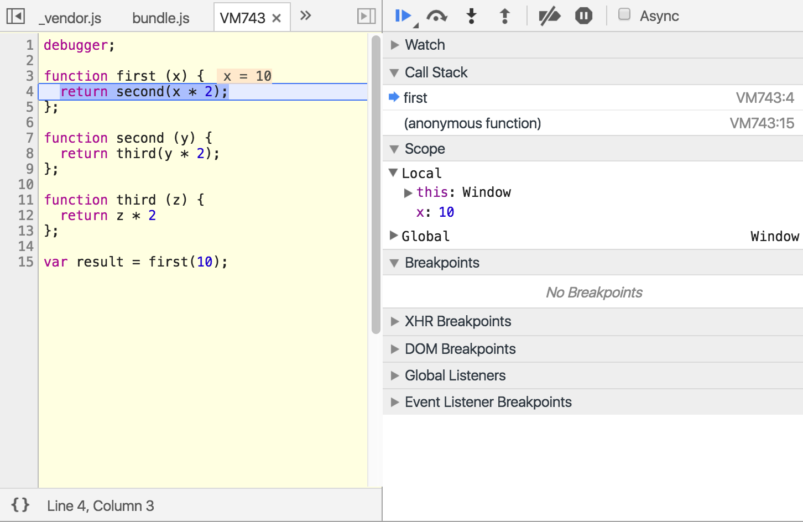
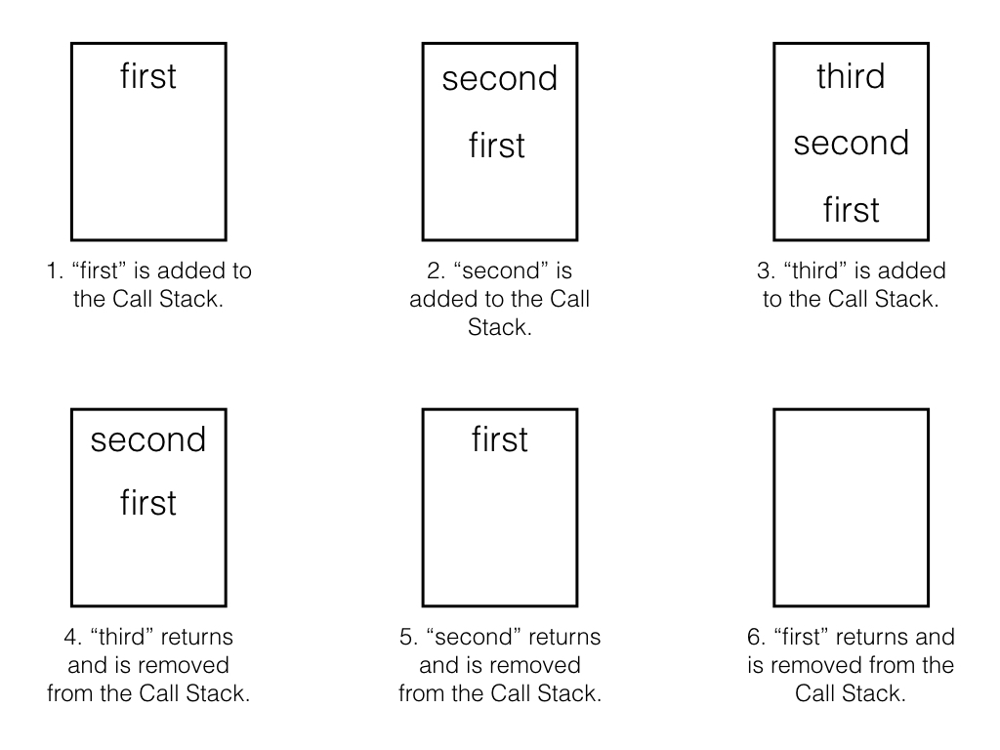

**_Main point:_** _Remember, our friend, the_ **_stack_**_? It's a simple data-structure that's like a cup: you put something on top, then retrieve it off the top. If you want to access the item on the bottom, you have to first clear all the items on the top. Javascript does this in the browser - when we invoke a function, it get's added to the stack, then when it returns, it get's popped off the stack._

  

Let's look at an example of the Call Stack in action. Copy/paste the following into your Chrome console:


```js
debugger;

function first (x) {
  return second(x * 2);
};

function second (y) {
  return third(y * 2);
};

function third (z) {
  return z * 2
};

var result = first(10);
```
  

With your dev tools open (and paused in the debugger), slowly click on the down arrow to step into the next function call:

  
  


As you do, notice the "Call Stack" section on the right. It will tell you which functions are being added and removed:

  


  


To summarize, this is what is happening as it relates to the Call Stack:

  



