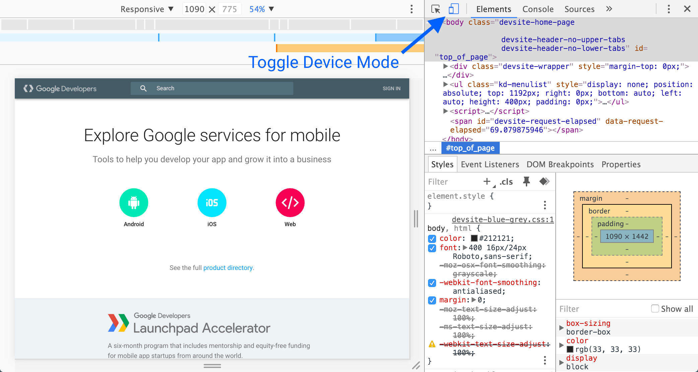

You are going to be designing this App for mobile!

  

Use the mobile icon in the top left corner of your dev tools (if you're using Chrome) pick the mobile device of your liking, and use this display while creating the design. Don't worry too much about Media Queries for now, just make sure it looks good on mobile as the default.

  

Here's where you can find the button if you've forgotten:

  

We recommend using Grid, because it's great.
