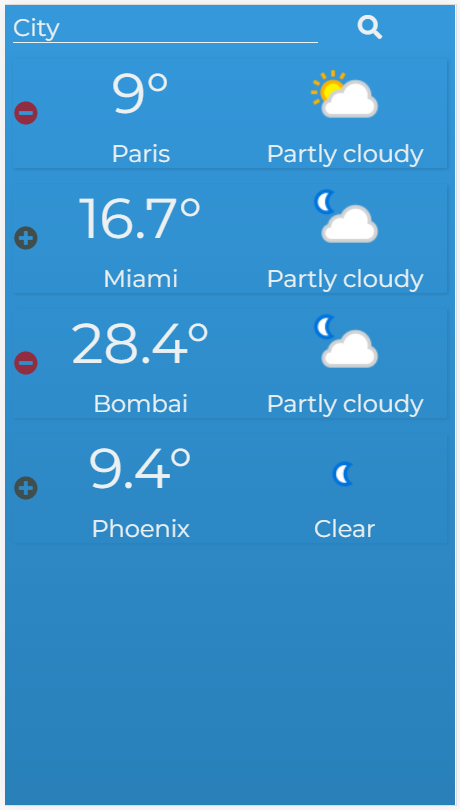

####   

#### **INTRO**

  

There are a lot of different weather apps on the market. Most of them get their information from some API and display it in a way that looks nice on your phone or desktop.

  

You're going to be creating your own weather app with the full stack!

  

In this project you will write a client using OOP and MVC design, create a server, access an external API from your server, and save data to a database with CRUD operations.

  

Weather you're ready or not, let's go!

  

----------

  

#### **PACKAGE REQUIREMENTS**

  

You'll need the following packages for this project:

-   body parser
-   express
-   handlebars
-   jQuery
-   mongoose
-   axios

  

You can also use font-awesome and moment.js, though neither are necessary.

  

----------

  

#### **WHETHER WEATHER**

  

You should work on this project in steps:

1.  Set up the server
2.  Set up your Schemas and DB
3.  Get data from the external API
4.  Set up the routes on your server
5.  Set up your client (MVC & OOP)
6.  Work on your Model
7.  Work on your Renderer (View)
8.  Work on your Controller
9.  Design (for mobile!)

  

Here we go!

  
