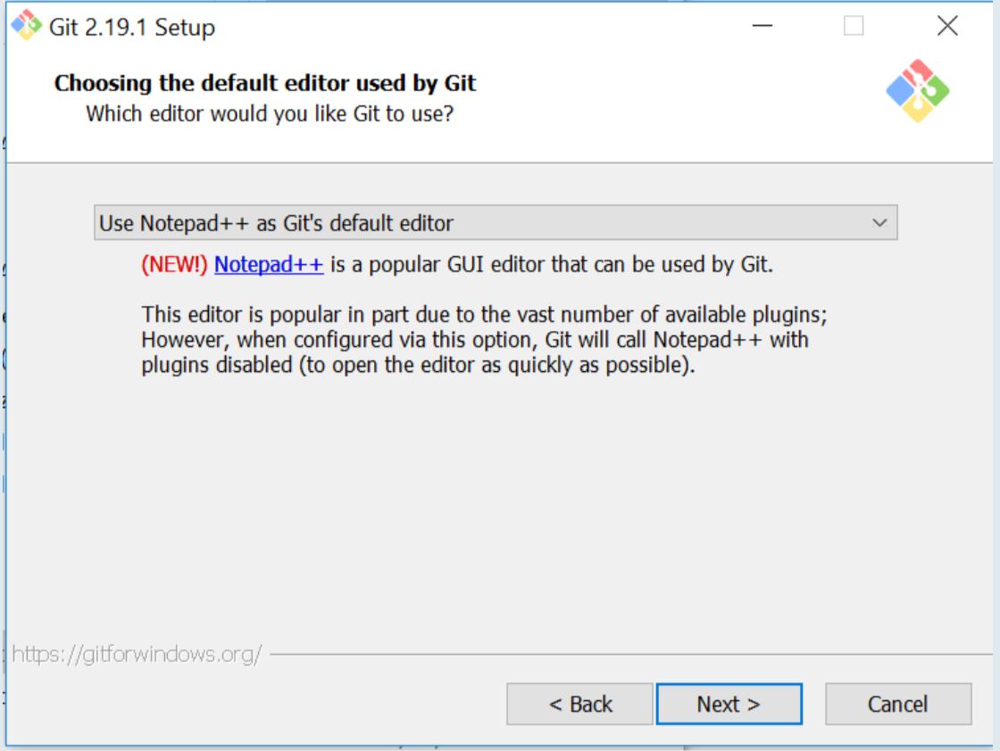

Download Git from [here](https://git-scm.com/downloads) and install it using the default settings.

  

**Important Installation Instructions**

  

start the installation and wait until you get to the page of selecting the text editor:

  

  

Make sure to select Notepad++ or atom as Git’s default editor.