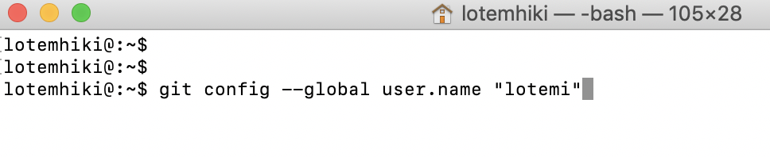

First, let’s open the cmd.

  

**Windows Users**

We recommend to work with git bash as your cmd, it will allow you to work Unix style (with Unix commands)

Of course you can also work with the built-in cmd

In the search panel type:

git bash

  

**Mac**

Type CMD + SPACE or click the magnifying glass in your top right corner to open up the "Spotlight" application and then just type "Terminal".

It should be the first result.

  

----------

  

So, we have our command line open:

  


  

Note that each line in the cmd starts with a $

  

  

It is a standard that when we want a specific command to be typed in the cmd we will add the $ in the beginning:

For example:

```bash
$ ls
```
  

That means we want you to open your cmd and in it type just: `ls`

(without the $. The $ is already in your cmd!)

  

To make sure git is installed correctly, let's type:
```bash
$ git --version
```
  

you should see the git version:

  


It is very important to validate the actions that we do, especially when we learn something new.

Take that as a tip :)

  

Now we are going to configure Git. If you have never used git before, you need to do some setup first.

It is a one time thing, so let's do it. If you have git already setup, you can skip this part.

  

Run the following commands so that git knows your username and email.

```bash
$ git config --global user.name "Your username"
$ git config --global user.email "your_email@gmool.mom"
```
  

For Example:

  

