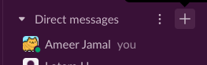
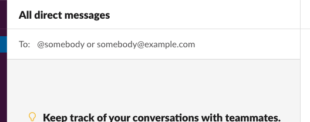

All of our communication will be done through slack.

once you are done with the previous steps. make sure to create a private chat between you and the Bootcamp Staff.

communication with the bootcamp staff will be done in that chat, that includes updating staff on any matter including **progress** in the **Codio**, **Tardiness** and **emergencies**.

you can do so by following the next steps, next to The **Direct Message** title if you hover you can see a **"+"** icon.

click the icon and it should prompt a search bar.

in the search bar, look up the **Bootcamp staff's names**. 
for example :

- **instructor** :Lotem Hiki
- **TA**: Ameer Jamal

after adding both of them. you will create a group chat which you will communicate with the Bootcamp staff through. 
Send a **"Done"** message in the chat to let the staff know that you have done it.

