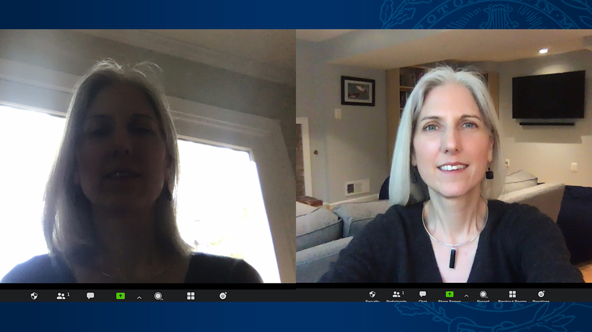
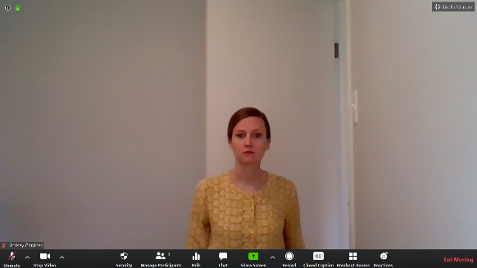

It is very important for us to be able to see you and interact with you. 

it is **Mandatory** to keep your camera open, unless there is a special situation and should be notified to the **Bootcamp Staff**.

Let's look at this picture

notice that the Women on the **Left** is in a dark setting and we cannot see her face. so make sure you are sitting next to a light source or facing a window.

we want to have our face clearly shown. not too far away and not too close. like the women on the **Right**

here is another example of how your camera should not be

the women is sitting too far away and we cannot see her face clearly.

so please make sure before you join the ZOOM call:

- the lighting is correct and we can clearly see your face
- the internet connection is working well and you are not lagging
- your camera is placed in a correct position where we see your face facing frontwards