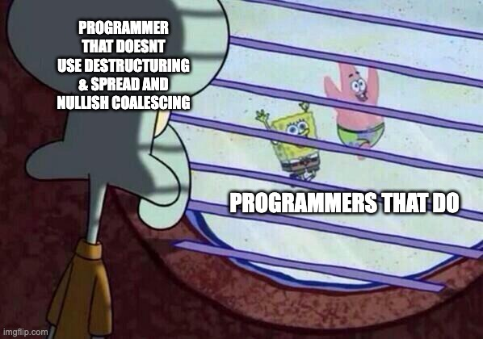

# Destructuring & Spread and Nullish coalescing

There are alot of different tools that can offer us different functionalities which are extremely useful.

Some of these tools are the following operators :

- [Destructuring](https://developer.mozilla.org/en-US/docs/Web/JavaScript/Reference/Operators/Destructuring_assignment)

- [Spread](https://developer.mozilla.org/en-US/docs/Web/JavaScript/Reference/Operators/Spread_syntax)

- [Nullish coalescing](https://developer.mozilla.org/en-US/docs/Web/JavaScript/Reference/Operators/Nullish_coalescing_operator)

Lets get started!