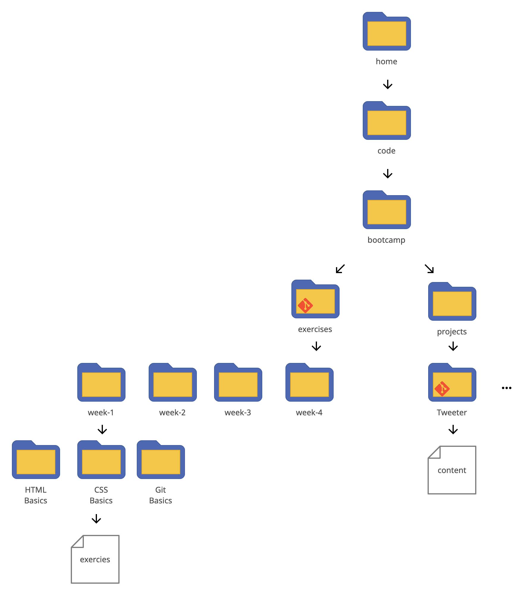

Code is just text that the computer can read. We save this code in normal, everyday files that are stored in a series of folders (also known as **directories**).

Go ahead and decide where you'll be saving all of our code for the bootcamp. It's a good idea to create a folder called **code** where you store everything and to create sub-folders for more specific work.

Here is an example. 
These are all folders:

Go ahead and create you own folder structure now and decide where you'll store the code you'll write for the bootcamp. Getting organized now will help you a lot in future!

**We will check up on the structure of your files later on in the course. so make sure you built it correctly!**

