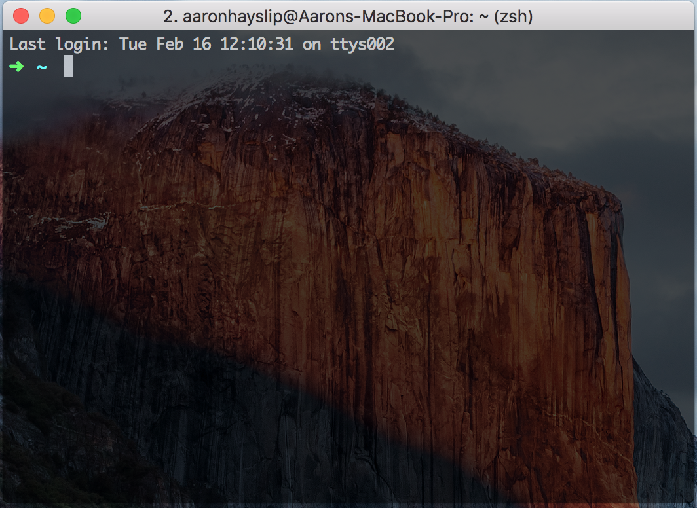
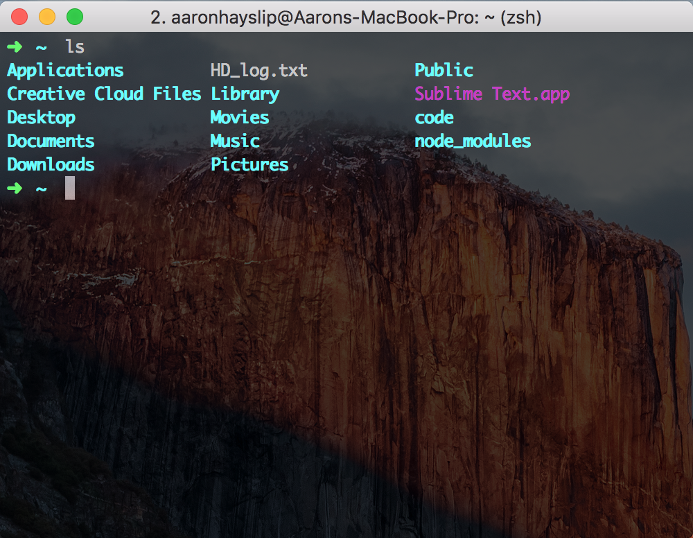
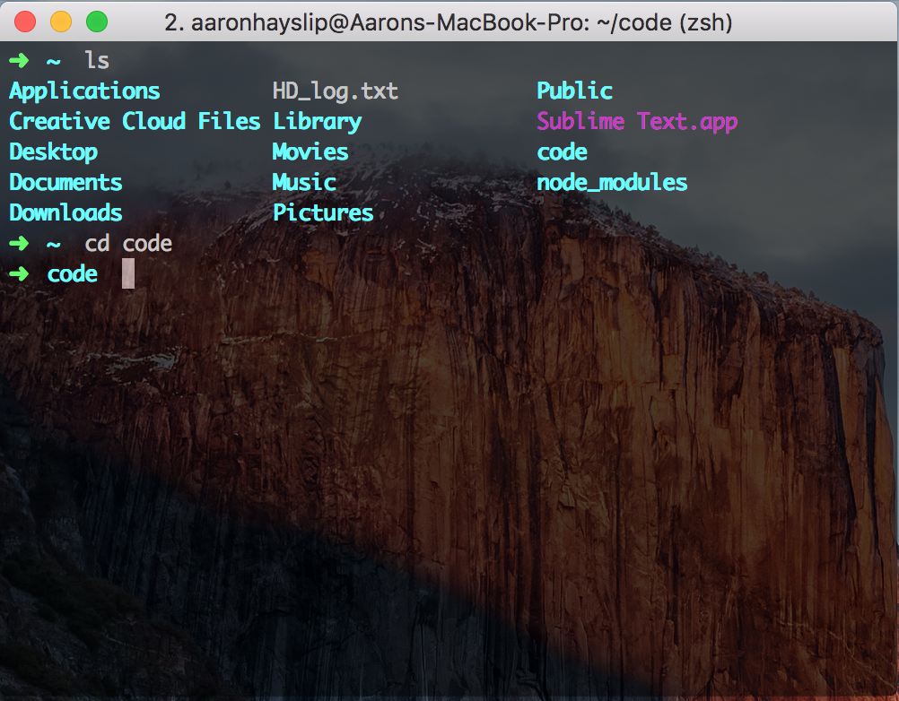
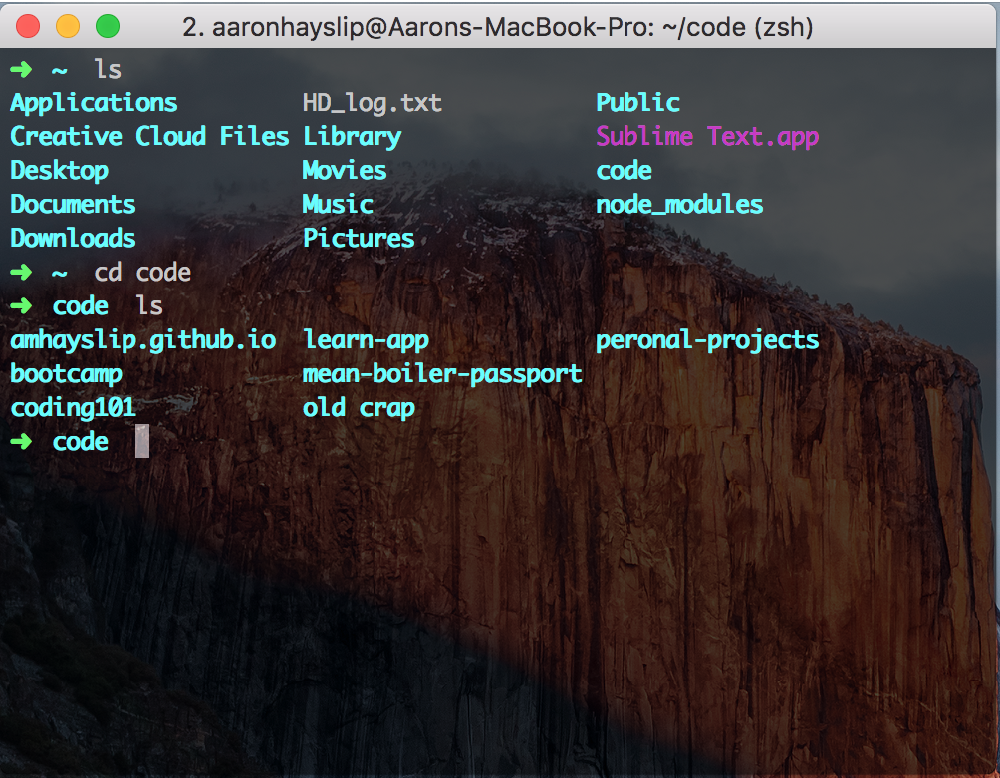
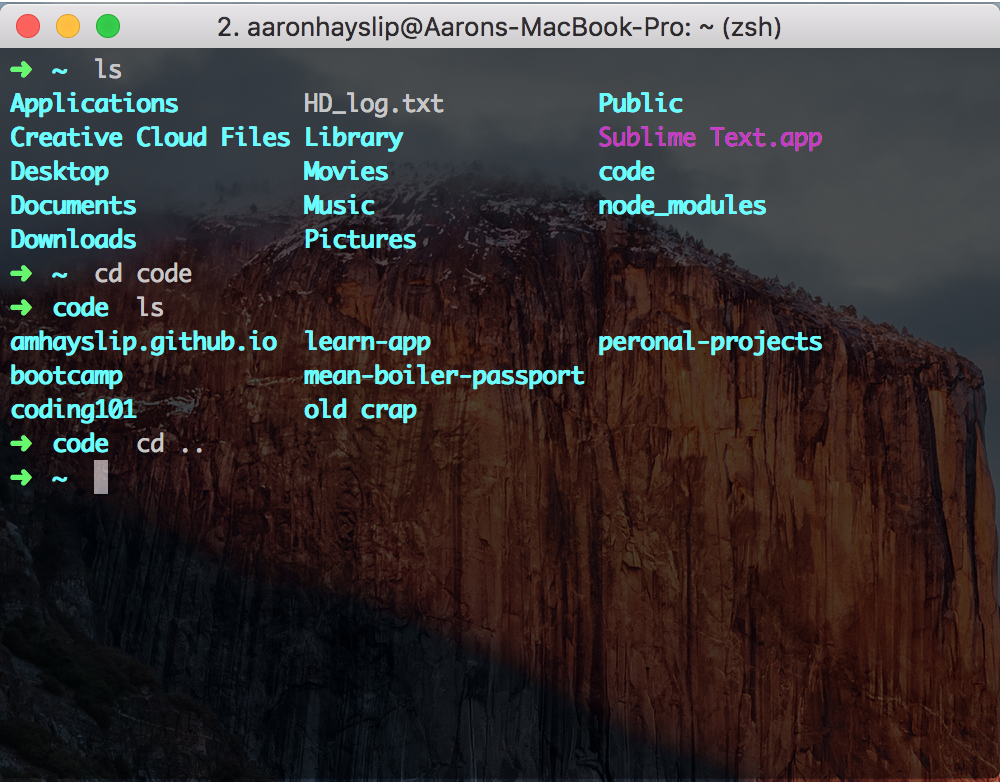

Until now, you might have used "finder" or the "start" menu on your computer to navigate through files and folders. As a developer, you'll be using the **command-line** quite a bit, so it will be much easier to navigate folders from there.

Go ahead and open your **command-line** now: if you're using a Mac this is called **Terminal** or **iTerm**, and if you're using a Windows Machine it's called **Command Prompt**. It will look something like this:



Or for **Windows**:


By default, your command-line will open inside of your "home folder". Let's see what's inside. If you're using a **Mac**, type in the following, then hit enter:

```shell
ls
```

If you're using a **Windows**, type in:
```shell
dir
```

Now you should see a list of your files and folders. Something like this:



Now to navigate forward into a folder you'll type in ```cd``` (change directory) plus the "folder_name". For example, if we wanted to get into a **code** folder, we'd type this:

```shell
cd code
```



Once again we can list all the files/folders in there by typing (mac):

```shell
ls
```

Or (windows):

```shell
dir
```



Now to back-up one level, we type (both Mac and Windows):

```shell
cd
```




