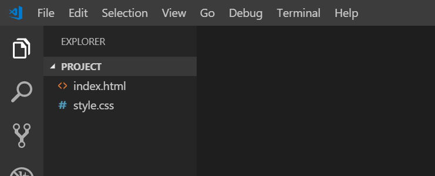

Using the commands we learned above, navigate to the folder where you want to create today's project (for example: **code> bootcamp > week-1**). Once you're there, type in: `mkdir project`.


This will create a new folder called "project". **mkdir** means, "make directory" and is used for creating folders. Now we will create two files inside this folder. First, "cd" into it by typing `cd project`.

Now, to create our new files we will type (Mac):

```shell
touch index.html
touch style.css
```

Or, if you're using a windows machine:

```shell
copy nul index.html
copy nul style.css
```

Now, if you type the command to list your files (For windows `dir` or `ls` for Mac) you should see your new files.

Now we want to open this project in our code editor so we can start writing some code in those files.

When you [download VS Code](https://code.visualstudio.com/download), after you install it on your computer you get a new command in your terminal called `code`.

We can use this `code` command to either open the current directory we're in, or to open a specific file/folder with VS Code.

So,
- if you are already in the `project` directory, simply type `code .` (that's a dot) and press enter
- Alternatively, you can type `cd ..` to go back to the `week-1` directory, then type `code project` and press enter


Either way should open up the `project` directory and all its files in VS Code, kind of like this:




