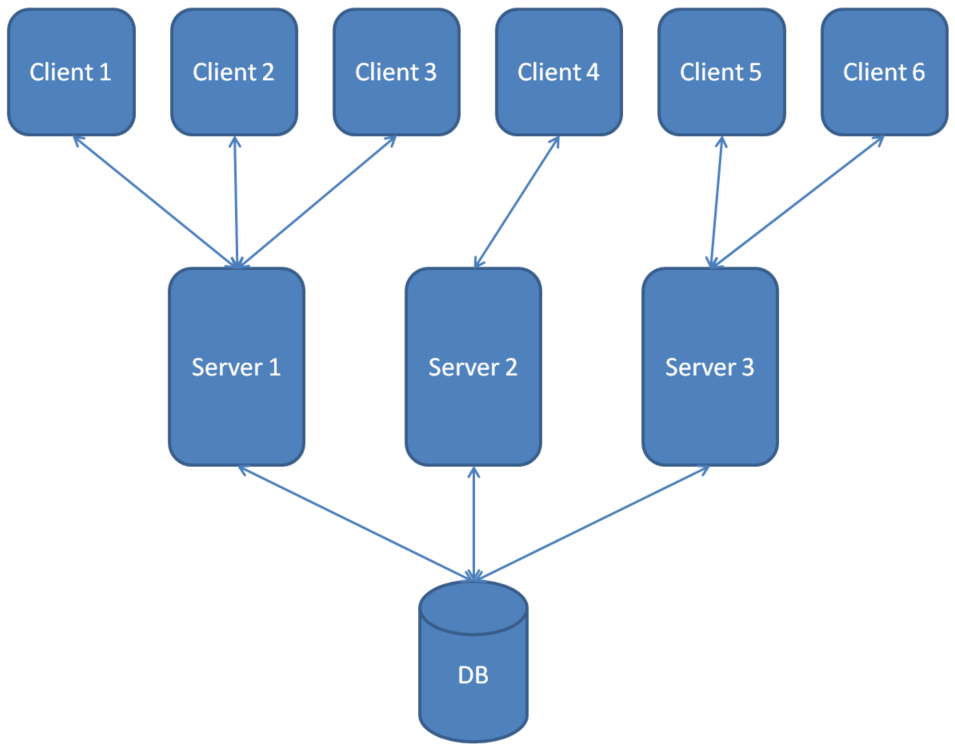

When you think of a database, you should think of it as **entirely separate from your application** - _almost_ like an external API.

  

Your application _will_, of course, eventually retrieve data from the DB, but **the data does not belong to the application** - for all intents and purposes, _any_ application could access this data, if you choose to allow it.

To visualize this, take a look at this architectural flow of data in a proper setup:

  

  

Often times there is **one** database which stores the **single source of truth** of our data.

We could have several servers and clients, but all of them are fetching their data from the same DB.

Note also that **the client accesses the DB through the server - there is no direct connection!** In other words, the client has no idea that the DB exists. It only talks to the server, and the server will do the work of storing, retrieving, updating, and deleting data.

  

This is true for both relational and non-relational DBs.

  

#### **END**

That's all for now. Keep these concepts in mind and let's start building some databases.
