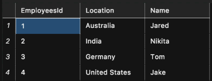

At its core, **a database is a place to store data persistently** - ideally in a secure way that is easy to access.

Up to this point, we've learned to store data using Local Storage, and in our variables in our server - but both of these have clear problems:

1.  Neither is 100% **persistent**
2.  Neither is totally safe

As such, the first term to understand is the concept of **data persistence** - once our data enters our database, it is there forever*.

 *Or until someone deletes the database, or the server burns

  

----------

  

Another important idea is that of **relational** vs. **non-relational** databases.

Traditional databases (such as SQL) are known as relational, and they work with **columns** and **rows** - much like Excel does.

A relational database may look something like this:

  

  

Each column has a **name**, and each row represents some **entity** - in the above each row represents an employee.

Each **cell** holds some value - these values can be strings, numbers, booleans, dates - and that's it. That is to say, **relational databases cannot hold complex data like objects and arrays in JavaScript** - only simple data.

  

----------

  

On the other hand, we have **non-relational** databases such as MongoDB.

Non-relational databases generally store their data in more JSON-like format, and may look something like this:

  

  

Here each "object" is generally known as a **document** - it represents some entity. In the above, it is the professional summary of some user named Amelia.

  

----------

  

The main difference between relational and non-relational database is the **structure**. We also call these **Structured** vs. **Non-Structured** databases.

In a structured DB, there is a defined order. New entities must enter the database according to the columns available.

On the other hand, in No-SQL (non-structured) DBs, **documents** have no structure, each document doesn't _have_ to have the same keys as other documents (though generally it should), and **in non-relational DBs, we can store any type of data we want**.

  

----------

  

In either case, when we talk about adding data to our database, we say that we are **inserting** data.

When we retrieve data back out of the DB, this is known as **querying** the data - from the word "query", which means a "question".
