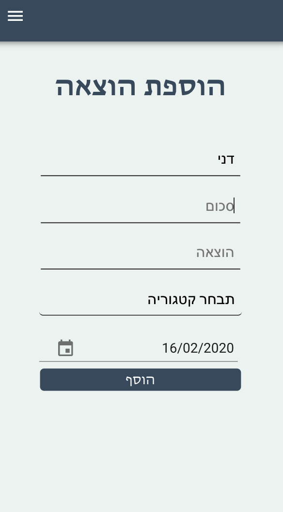
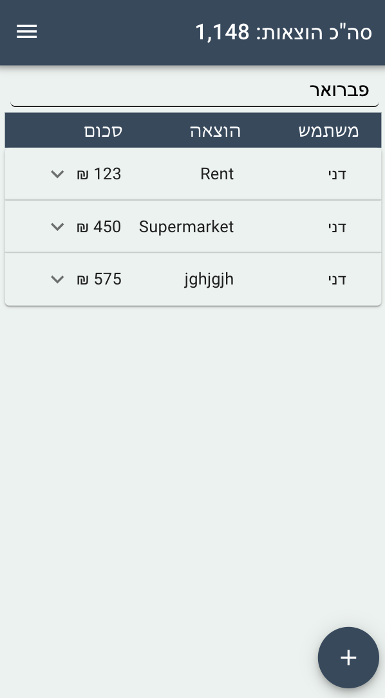

Great job getting so far 💪

  

Now, you can create the frontend part of the app:

Create a `Renderer` class with 2 functions (`renderExpenses` & `renderAdd` ) - you should be using Handlebars to do the rendering, you can use 2 different scripts.

Create a `ExpenseManager` class with at least two methods:

1.  `addExpense` - sends a post request to your server to add a new expense and updates the expenses array with the new expense.
2.  `getExpenses` - sends a get request to your server to receive all the expenses and updates your expenses array.
3.  The class should have an expenses array inside of it.

Your `main.js` file should handle the interactions with the user and call the correct methods in the `ExpenseManager` and Renderer.

  

----------

  

**Extension**:

1.  Add 2 date-pickers on the expenses page and 2 parameters to your `getExpenses` method which are dates. When it receives these parameters it should add them to the request to get expenses in a date range.
2.  Add a dropdown for groups of expenses to display expenses by group.

Here are a couple pictures for guidance but please get as creative as you’d like, but make sure the design is nothing less than great.
Note that in this example we added a user name, which is not required by you (but would be great to implement if you like!).

  

