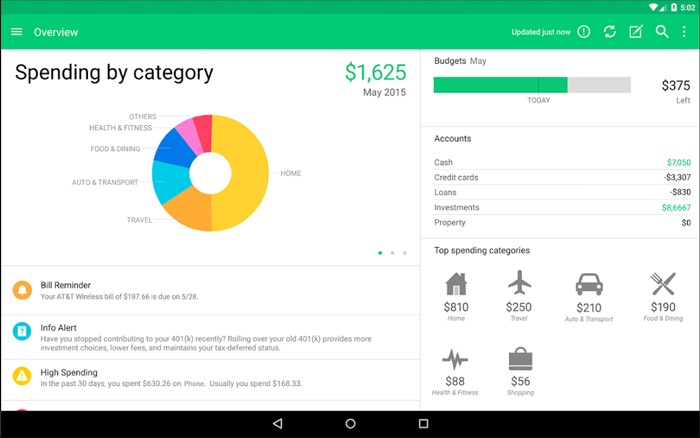

Now that you are one with the Mongeese, you'll be building a back-end only expense tracker. This project will use Express, Mongoose, CRUD operations, and a whole lot of pazzaz.

  

You'll be able to add new expenses to your tracker, see how much money you've spent on a given category or between certain dates. Let's get started.

  

This is a back-end only project, so everything you make will be server-side, and you will interact with the server through Postman.

  

