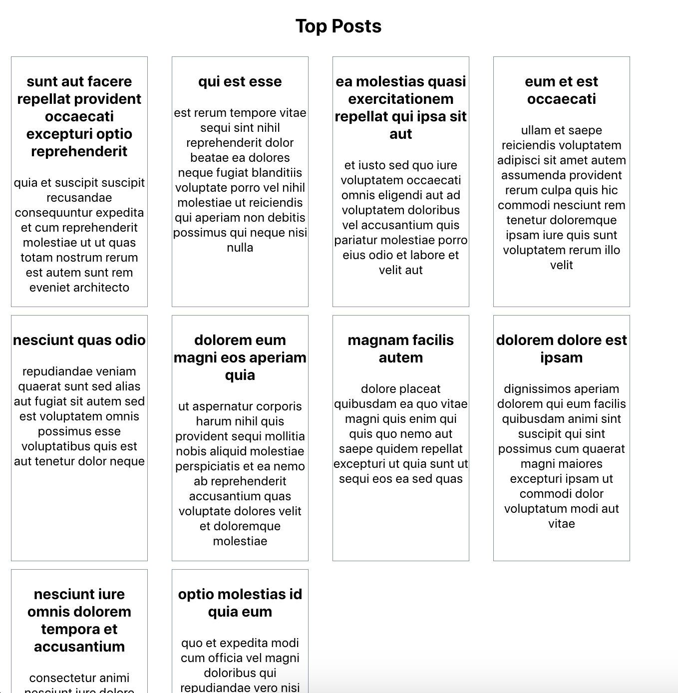
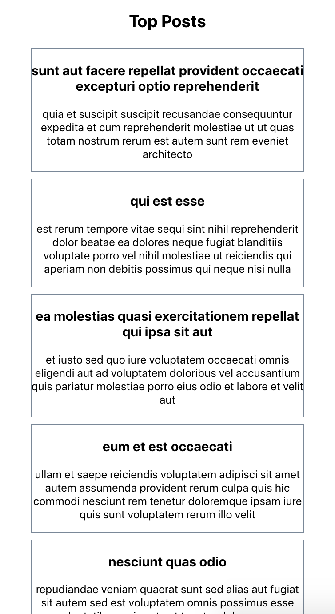

# Ex 1
Create a component that displays the current time, updating every second with the help of useEffect.

Remember to use cleanups, if needed.

# Ex 2
Create a React component that fetches posts data from an API and displays it on the page.
You can use this [mock data](https://jsonplaceholder.typicode.com/posts).
Display only 10 posts, one next to the other.
It can look something like this:

# Ex 3
In this exercise we will continue with the code from the previous exercise. Use the resize event to change the appearance of the posts to be one after the other when the screen is smaller.
Something like this:

