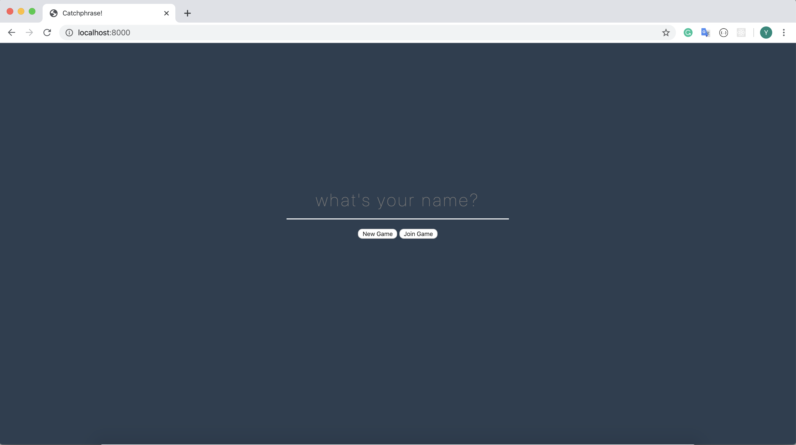
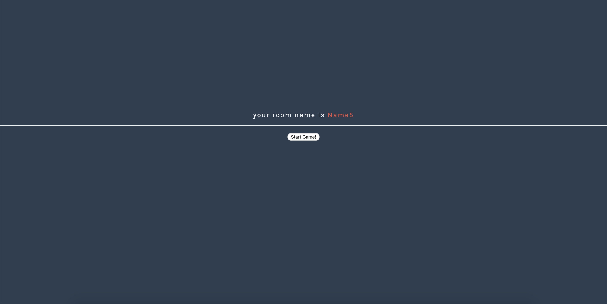
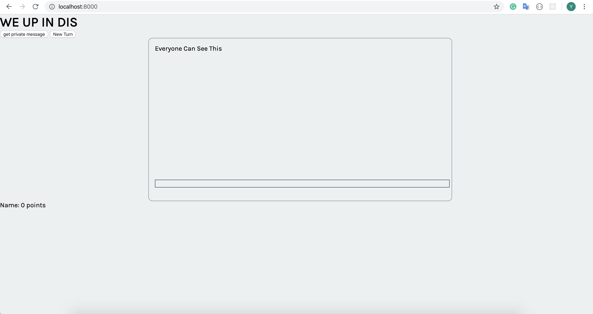
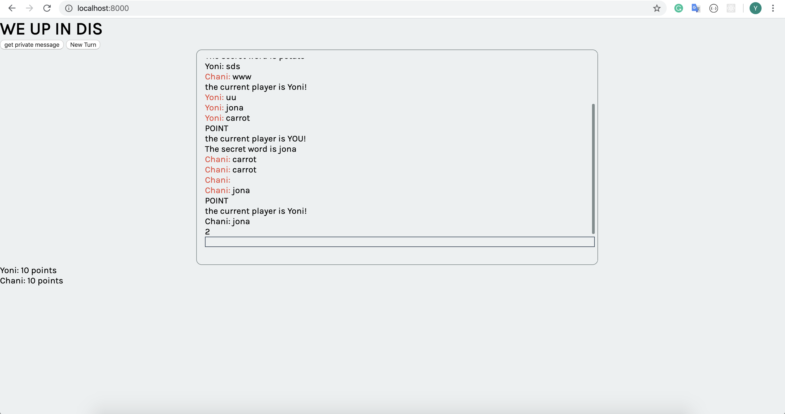

Before beginning to write any code, please read through all the instructions and check out the screenshots to understand the architecture. It is also recommended to draw out the architecture on a piece of paper before you start coding.

  

**Client**

  

The client side comprises of two parts:

 -  Join or create a game: In this part the user must add their name, and then click on 'create a game' or 'join a game'.
 -  The game board, which includes:
	a.  A chat room - an area where the users can chat together
	b.  A 'Get Secret Word' button - clicking this will give the user a secret word that they will need to describe to the other players
	 - You can append the secret word to the chat area (only for the player
   who is describing the word)

	c.  Score view - list of all the players and their scores

  

----------

**Server**

On the server side you will need to handle the following (and more) options with socket.io:

-   Login of a user - add the user to a data structure when they click 'create/join a game'

	-   No need to use a DB, just store it on the server
-   New game - when the user chose to create a new game you must handle this on the server
-   Join game - when the user decides to join another game, you will need to add them to the correct game and let the other users know that they have joined (think of how when someone joins a Whatsapp group you get notified)
-   New message - when a player sends a message
	-   You will need to check if it's a guessing message or a describing message
	-   If necessary:
		-   Add points to the correct player
		-   Change turns
		-   Let the players know the guess was correct

Fell free to add more functionality and to handle more edge cases.

  

Here are some screenshots for inspiration:

  

