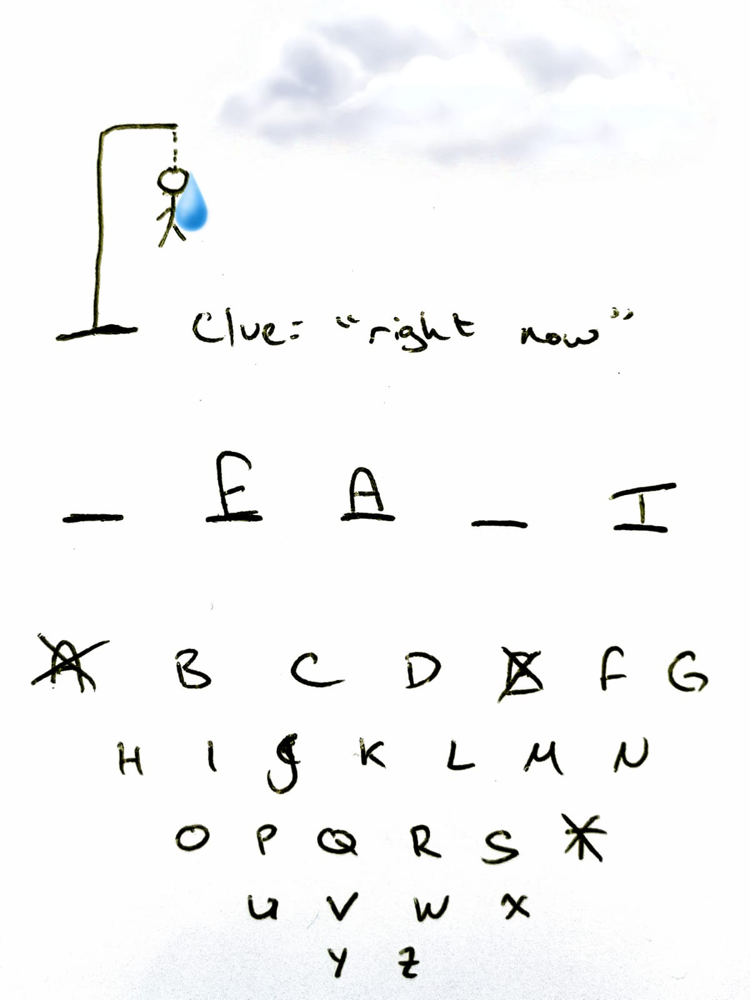

Throughout the React fundamentals lessons, we're gradually going to build the classic game of _Hangman_. The rules of the game are simple:

  

-   There is a secret word
-   There is a hint for the word
-   The user sees a blank line for each letter in the word
-   Each time the user selects a letter (from the alphabet), it fills up the blank lines _for each_ occurrenceof the word
-   If the user selects more than 5 letters without guessing the word, the game is lost

  

Here is a modern depiction of the game:

  

Our app will not look like this - in fact it will be quite bare-boned. We do this to make it easier to focus on the React fundamentals.

  

Ultimately - once you're done with the fundamentals - your game will look something [like this](https://s3-us-west-2.amazonaws.com/learn-app/lesson-images/react/React+Hangman.mov).
