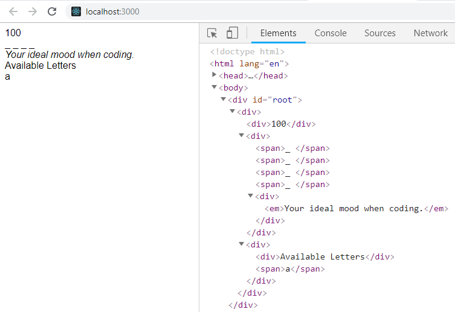

To start, go ahead and **create a new project using create-react-app** locally on your computer- call it `hangman`

  

Then, go to your GitHub account and create your own new repo called "Hangman".

  

Follow the instructions to **push an existing repository** on Github to connect your local project.

Once you're set up, create your components folder inside of `src`

  

Next, use this component tree to create the required components architecture (explanation below):

  


  


Here's what each of these should do:

  

**Solution**

-   For now, this component **should not** load the `Letter` component - we'll fix that later.
-   This component will display empty spaces* ( `_ _ _ _` ) representing the letters the user has to guess.
-   It will also display the hint for the word to be guessed.

<sup> *For now, use an array with four underscores, along with the `.map` array method.

  

**Score**

-   For now this should only render a single, hard-coded number. Ultimately this will keep track of how many guesses the user has left.

  

**Letters** (plural)

-   Should render a simple string, _and_ load the `Letter` (singular) component. Ultimately, this will load _all_ the available letters: A - Z

  

**Letter**

-   Should only render a single letter - hard-coded for now, but in the future the letter will be more dynamic.

  

The `App` component should render all of the above, and ultimately your page should look like this:

  


Click [here](https://s3-us-west-2.amazonaws.com/learn-app/lesson-images/react/hangman-1-desired-result.PNG) to embiggen.

  

In terms of component hierarchy, you can think of it like this:

  
```js
<App>

  <Score />
  <Solution />

  <Letters>
    <Letter></Letter><Letter></Letter>
    .... //Eventually we will display all the available letters here: A - Z
  </Letters>

</App>
```
  

True, nothing miraculous is happening just yet, but components are just the building blocks of React. They're like the HTML of a webpage; alone, they're just placeholders for content.
