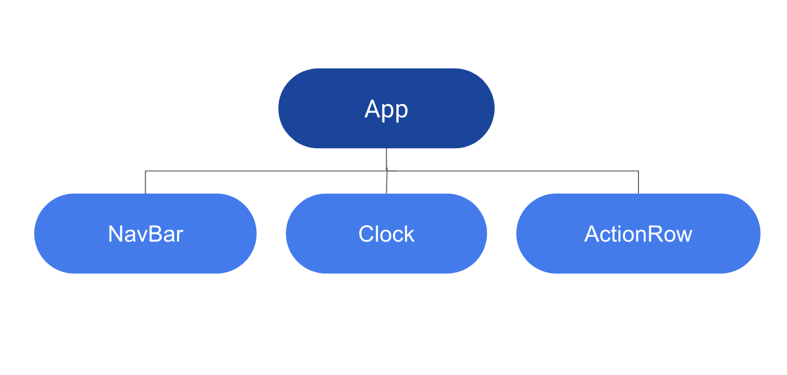

You should have (at least) the following components:

-   `App` - the main component, contains the `NavBar`, `Clock`, and `ActionRow` component
-   `NavBar` - contain two buttons
-   `Clock` - shows the timer
-   `ActionRow` - contain the start/pause and reset buttons.

