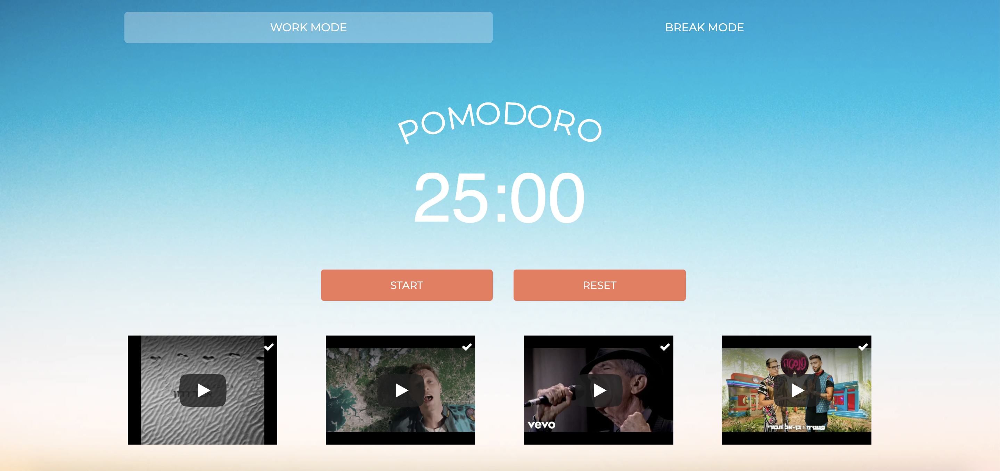

Pomodoro is a technique for time management that uses a timer to break down work into intervals, traditionally 25 minutes in length, separated by short breaks of five minutes.

  

The app should have three main components/parts:

-   Navigation bar with two buttons (Work Mode & Break Mode)
-   Timer.
-   Stop/Reset buttons

  

It will look something like this (in the meantime, don't pay attention to the videos below):

