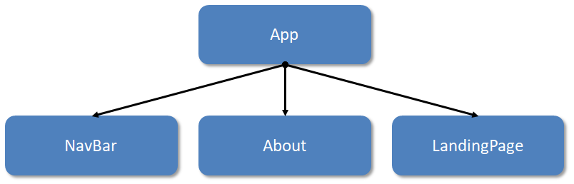

When we have more interesting parent-child relationships, it generally helps to draw out a **component tree** - this is a visual representation of our **component hierarchy** - i.e. who is loading whom.

  

In our earlier `LandingPage` / `About` example, we could draw the component tree like so:

  




  

The `App` component is the parent of all three children components. Notice that this also corresponds to the literal parent-child relationship in our JSX:

  

```js
function App() {
    return (
      <div className="app">
        <NavBar />
        <About />
        <LandingPage />
      </div>
    )
}
```
  

The three children components are nested JSX rendered by `App` - this is what we mean by component hierarchy.

  

**Note:** the component tree does not necessarily represent what is _on_ the page, but rather shows us which component is responsible for rendering which other component.
