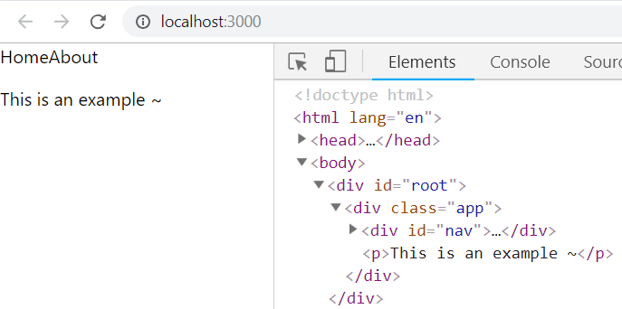

Remember that everything in React is just objects. To appreciate that, take a look at this code:

  

```js

function AboutUs() {
	return <p>This is an example of an about us page~</p>
}

function Nav() {
	return (
		<div id="nav">
			<span>Home</span>
			<span>About</span>
		</div>
	)
}

function LandingPage() {
	return <h1>Welcome!</h1>
}

function App() {
	let isUserLoggedIn = localStorage.getItem('loggedIn')
	let componentToDisplay = isUserLoggedIn ?
		<LandingPage /> :
		<AboutUs />

	return (
		<div className="app">
			<Nav />
			{componentToDisplay}
		</div>
	)
}
```


This may seem like a lot, but take it slow. Start by **looking at** **`App`** **- look at the logic before the** **`return`**:

  

-   Using `localStorage`, we're determining which component to display: `LandingPage`, or `AboutUs`
-   We store that component inside a variable: `componentToDisplay`
-   Inside the `return` we display the `Nav` component (nothing new here)
-   We display `componentToDisplay` - i.e. _whichever_ component was determined based on the previous `isLoggedIn` condition

  

Notice that we wrap `componentToDisplay` inside of **curly braces - we do this because it's a variable**! In order for React to know that it's a variable, and as per the rules of JSX, we must wrap it in curly braces.

  

If you were to look at the browser now (assuming you don't have "loggedIn" in your `localStorage`), you should see something like this:
 


Notice in the Elements tab that we don't see the `LandingPage` component at all - it is not rendered!
