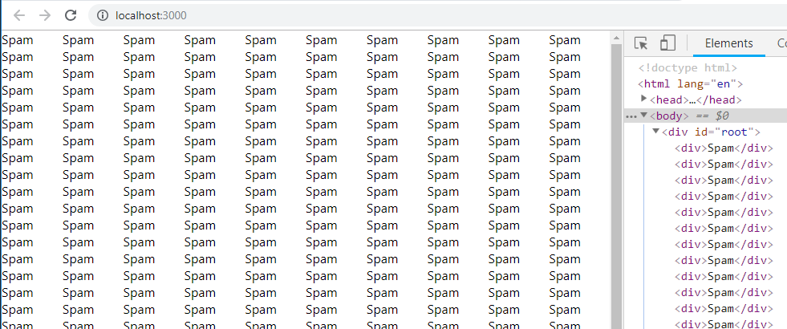
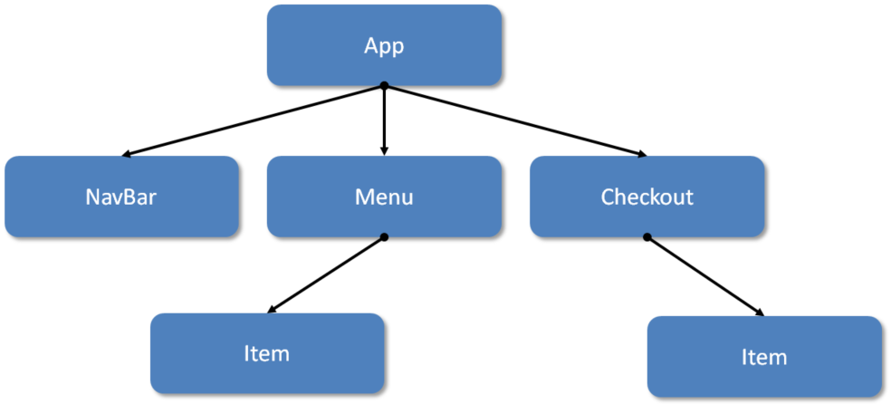
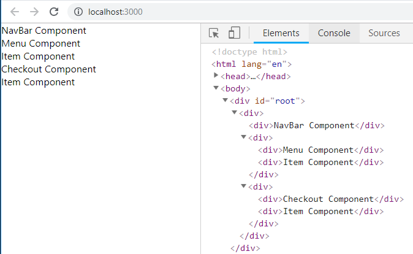

Go to this [GitHub repo](https://github.com/Elevationacademy/react-components-exercise) **fork** it, and then **clone** it.

Don't forget to run `npm install` and then `npm start`
***

 ## Exercise 1

    
Components on their own may be a little boring before we understand how data moves between them, but we need to make sure we _get it_ before moving on.
    
      
    
  For these exercises, we'll **have our components in separate files**.
    
      
    
To keep things organized, **take a look at the** **`components`** **folder inside of** **`src`** - all the components you'll need for these exercises are in here - you just have to fill them out and have `App` load them properly.
    
      
    
Note that we've taken care of the exports/imports for you!
    
      
    
*******
    
      
    
For **Exercise 1**, go ahead and check out the `Dummy` component inside your components folder.

    
      
    
Add some code so it renders an `input` and a `button`
    
      

Your `App` component should render `Dummy` onto the page.
    

If you're using VS Code, the [Auto Import](https://marketplace.visualstudio.com/items?itemName=steoates.autoimport) extension might be helpful.

    
## Exercise 2
   
    
In your components folder you'll find a Spam and Spamalot component. Please follow these instructions:
    
      
    
 
1.  The `Spam` component should render a `div` with the text "`Spam`"
3.  The `Spamalot` component should load `Spam` 500 times

    
      
 **Note:** certainly, do **not** copy-paste 500 times. Be clever, and remember that the `render` method can return an **array** of JSX.
    
      
    
Next, use your **App.js** to render `Spamalot`, and check out the following CSS in your **App.css**:
    
      
    

 ```js
#ex-2{
      display: grid;
      grid-template-columns: repeat(10, 1fr)
    }
```
      
    
Your page should look like this:
    
      

    

    

    
## Exercise 3
    

    
Sketch out the component tree for the previous exercise.
  
    
If it doesn't look [like this](https://s3-us-west-2.amazonaws.com/learn-app/lesson-images/react/spamalot-tree.PNG), stop and take more time to understand this concept.
    

    
## Exercise 4
    

    
Using the relevant classes in the components folder, create the component tree in the image below.
    
      
    
Notice that some of the component names are similar as what you saw in the previous Spot Checks, but **different**, i.e. `Nav` vs. `NavBar`.
    
      
    
For now, each component should render a simple `div`. In this `div` you should have:
    
   -   Some text with the name of the class (see image below component tree)
    -   An instance of any relevant children components
    



      
      
Make sure your code is **DRY**.
    
      
    
Along with the results from your other exercises, this exercise should result in something like this (order is important):
    
      
    

    
      

       
    
Note that your **Exercise 4** code in `App.js` should look like this:
    
      

```js
   //Your Imports
export function App() {
    return (
        //other exercises...
        <div className="exercise" id="ex-4">
          <NavBar />
          <Menu />
          <Checkout />
        </div>
    )
}
  ```  
      
    
All your other components should be coming from the separate files in the components folder.
