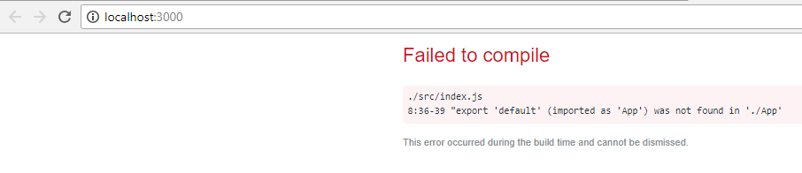

## Intro

React works with components. From [the docs](https://reactjs.org/docs/components-and-props.html), here is a formal definition of a **component**:

  

_Conceptually, components are like JavaScript functions. They accept arbitrary inputs (called “props”) and return React elements describing what should appear on the screen._

  

In broader terms, you can think of a component as **a part of our application used to render some data**.

  

For instance, if we had a restaurant app, we might have a component for the entire menu, and then sub (children) components for each menu item.

  

We could use these children components either inside the parent menu component - or elsewhere, for instance in the "check-out" section.

  

As for the **react elements** mentioned in the definition above - that is exactly what JSX returns: react elements.

  

For this lesson, we will ignore "props", and instead focus on components and the **component tree**, which we'll get into later.

  

## **Components**

A basic component is nothing more than a simple js function.

  

The simplest component looks like this:


  

```js

function App() {

  return <div>Hello, world</div>
    
}
    
export default App;
```

notice this bit:


```js
export default App;
```
  

This is exporting the component we created above, and is important because otherwise we could not access it from other files!

  

In fact, if you **commented out that line** and then looked back at your page, you would see this:

  



Exactly what we said before. In the **index.js** file - the file that is trying to use <App /> - we get an error!

Look at this **import** at the top of **index.js**:

  

```js
import App from './App';
```
  

It's not messing around; if we don't **export** App, how can anyone **import** it?

Lesson learned: **you must export all your components so that others can import them.**

  

**Important Note about Imports**
We can also export components by writing **export default** just before the function
```js
export default function App() {
  ...
}
```

Or we when we have multiple components in the same file (which you will see in this lesson), we can simply use `export`
```js
export function App() {
  ...
}

export function MyComponent() {
  ...
}
```

Then we will have to import these components like this:
```js
import { App, MyComponent } from './App';
```
However, conventionally components should be written in separate files.
