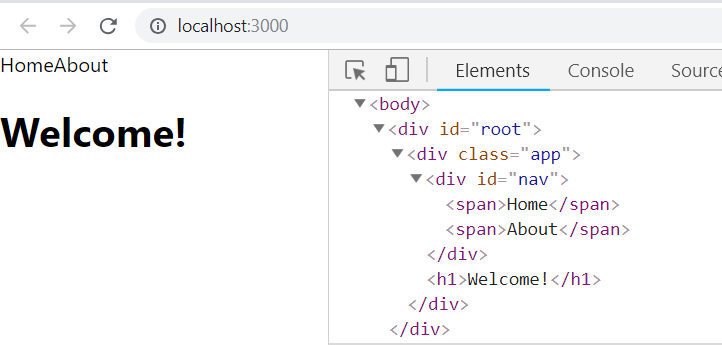

Before attempting this Spot Check, make sure you've gone back to your `index.js` and changed `ReactDOM.render(...)` so it renders your `App` component instead of `Sum`.

  

***
Here is a component called `LandingPage`:
```js
function LandingPage() {
	return (

	)
}
```
  
Add some code so that it renders an `h1` with "Welcome!", and load that under the `Nav` inside of `App`. 
This new child should come instead of the current `<div>Welcome!</div>`

  


  

If you did it right, your page should look something like this:

  


  


Notice that ultimately, **React components and their JSX render normal HTML** - with the exact parent-child relationships we expect.

  

Of course, **we can keep nesting components forever** - but that becomes more of an architectural decision than a technical one.

  

In general, **each component should be responsible for a single, independent part of the app** - that doesn't mean a component should be so small that it's only a single `div`, but it should only have **one responsibility** - just like normal OOP.


<details>
  <summary>
     See our solution if you're stuck
  </summary>

```js
function Nav() {
	return (
		<div id="nav">
			<span>Home</span>
			<span>About</span>
		</div>
	)
}

function LandingPage() {
	return (
		<h1>Welcome</h1>
	)
}

function App() {
	return (
		<div className="app">
			<Nav /> 
			<LandingPage />
		</div>
	)
}
</details>