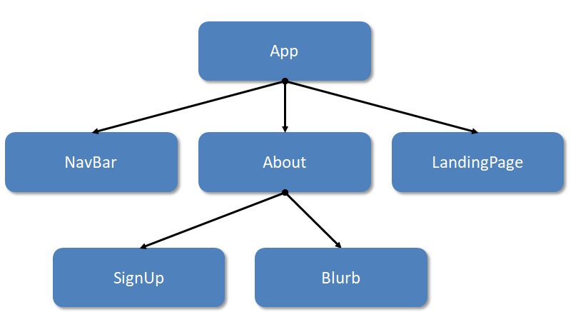

Here are some components for this spot check:

```js
function About () {
  /* your code here... */
}


function SignUp (){
  /* your code here... */
}

function Blurb (){
  /* your code here... */
}
```

  

Add some code to them to complete this component tree:



  

In particular, make sure that:

-   The `App` component is rendering `About`*
-   `About` is rendering `SignUp` and `Blurb`
-   `SignUp` and `Blurb` are rendering some content

  

*Render the `About` component in the relevant `div` in `App`.


<details>
  <summary>
     See our solution if you're stuck
  </summary>

```js
function Nav() {
	return (
		<div id="nav">
			<span>Home</span>
			<span>About</span>
		</div>
	)
}

function LandingPage() {
	return (
		<h1>Welcome</h1>
	)
}

function App() {
	return (
		<div className="app">
			<Nav /> 
			<LandingPage />
		</div>
	)
}
```
</details>