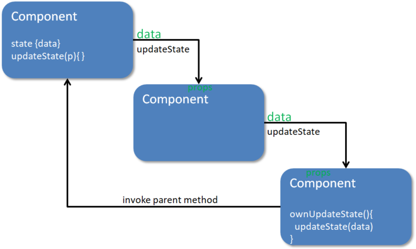

Following the previous exercise, we understand that **this is how we allow children components to affect their parent's** **state** - and this is what rounds up our understanding of **data flow** in React.

  

In short: **data goes down through props, and callBacks can go up** the component hierarchy.

  

Visually, you can think of it like this:

  

  

-   We have some `state` in a parent component
    -   This `state` determines what data this component and its children render
-   There is some method(s) inside of the parent that modifies `state`
    -   Because the children components have the required data to update `state`, _they_ need access to this method
-   We pass down the data _and_ the relevant methods to the children that need it
-   The children then invoke _their own_ method, which in turn calls a callback method to update the `state of an ancestor component.`

  

Finally, **when state is updated, React will re-render the DOM for us** - no matter _who_ called the **useState set method**.