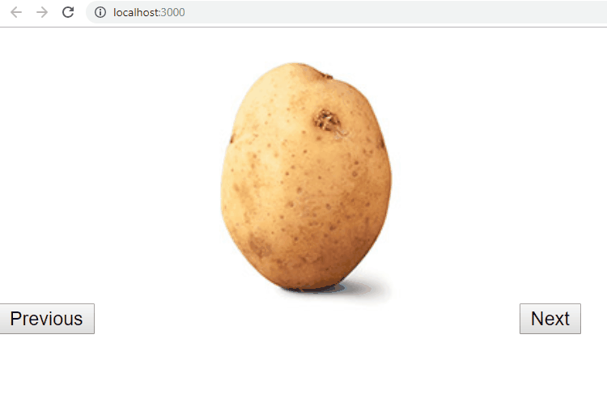
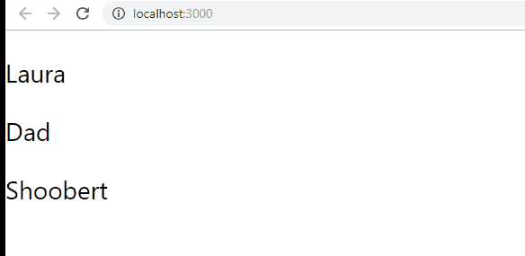

## Exercise 1

For this exercise, you're going to create a simple image gallery.

  

Start by finding this data to `state` in your `Exercise1` component:

  
```
{
      images: [
    "https://hips.hearstapps.com/hmg-prod/images/lychee-fruit-sugar-1530136136.jpg?crop=1xw:1xh;center,top&resize=640:*",
    "https://hips.hearstapps.com/hmg-prod/images/mango-fruit-sugar-1530136260.jpg?crop=1xw:1xh;center,top&resize=640:*",
    "https://hips.hearstapps.com/hmg-prod/images/cherries-sugar-fruit-1530136329.jpg?crop=1xw:1xh;center,top&resize=640:*",
  ],
      currentImg: 0
    }
```
  

You should now define two methods (in Exercise1):

1.  `shiftImageBack` - this should reduce `currentImg` by 1
2.  `shiftImageForward` - this should increase `currentImg` by 1

  

Finally, in your render, you should render two buttons with the classes "back" and "forward", and the image with an `img` tag at index currentImg

  

Each button should invoke the appropriate function, and ultimately your page should look like this:

  



## Exercise 2
For the rest of the exercises, you're going to create a "conversation" app. The base of this App (Exercises 2 - 7) will be Exercise2.js.


You will have a list of contacts, and when you press a contact you'll see the conversation with that contact, like so:




For starters, here is your data - you will find this in `Exercise2`'s `state`.


```
{
    displayConversation: null,
    conversations: [
        {
            with: "Laura", convo: [
                { text: "Hi", sender: "self" },
                { text: "You there?", sender: "self" },
                { text: "Yeah, hi, what's up?", sender: "other" }
            ]
        },
        {
            with: "Dad", convo: [
                { text: "Have you finished your school work yet?", sender: "other" },
                { text: "Yes.", sender: "self" },
                { text: "What do you mean, yes?", sender: "other" },
                { text: "??", sender: "self" }
            ]
        },
        {
            with: "Shoobert", convo: [
                { text: "Shoobert!!!", sender: "self" },
                { text: "Dude!!!!!!!!", sender: "other" },
                { text: "Shooooooooo BERT!", sender: "self" },
                { text: "You're my best friend", sender: "other" },
                { text: "No, *you're* my best friend", sender: "self" },
            ]
        }
    ]
}
```

Start by writing your `Exercise2`'s `return`.


It should, based on the value of `displayConversation` render either the list of contacts - use a component called `List` for this - or a `Conversation` component.


If `displayConverastion` is `null` - `Exercise2` should display `List`, otherwise it should display `Conversation` - for now both of these components can be empty, just make sure it's working.

## Exercise 3


Next, we'll work on `List`

  

This component should receive "contacts" through `props` - i,e. `Exercise2` needs to send it an array with the values Laura, Dad, and Shoobert - of course, do not hard code this. Use the `map` method to extract only the data you need from the conversations array in `state`

## Exercise 4


Now create a `Contact` component. This should render a name of a contact received from `props`.

  

Your `List` component should iterate over all the contacts it received, and render a `Contact` for each one.

  

At this point, when you load the component, you should see a list of contacts.

## Exercise 5


Now we're going to work on updating the `displayConversation` property in `state`.

  

This property should either be `null` if we are displaying the list of contacts, or be the _name_ of the contact whose conversation we want to see (i.e if we want to see the conversation with Shoobert, then the value of `displayConversation` should be "Shoobert").

  

Therefore, write a method (in `Exercise2`) called `displayConvo` that receives a single name parameter, and updates the value of `displayConversation` with that name.

  

However, it is `Contact` that is going to invoke this method - so you'll have to pass the method down (twice*), and then invoke it correctly in `Contact`.

Note that `Contact` has access to the name of the contact.

###### *You'll first pass it from `Exercise2` to `List`, then `List` will pass it down to each `Contact`

## Exercise 6


Now create the `Conversation` component. This component should receive a single `convo` array from props, based on the value of `displayConversation`.

It should _also_ receive a prop called `sender` with the person with whom the conversation is happening - conveniently, that is stored in `displayConversation`

  

Forget any design for now - you can just render something simple like:

Me: "Hi"

Laura: "Hello"

  

Each message should be in a separate `div`, and each `sender` should be in a `span` inside with the class `"sender"`

  

Using "Me" for any time the `sender` is "self", and the name of the other person any time `sender` is "other"

## Exercise 7


Finally, add a `Back` `button` with the class `"back"` to your `Conversation` component.

  

This `button` should update the value of `displayConversation` in `Exercise2`'s `state` to `null`

  

At this point, you're already a pro - so no further instructions required for this exercise ;)