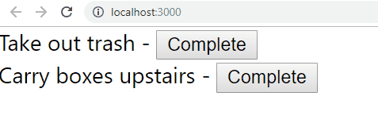

You are given the following object.

```
{
  tasks: [
    { text: "Take out trash", complete: false },
    { text: "Trash talk Carrie", complete: true },
    { text: "Carry boxes upstairs", complete: false }
  ]
}
```
  

Now you need to do the following:

- Display Each Task's text, and a button called Complete, with the class "complete"
    -   a functionality that filters completed tasks.
-   Clicking the Complete button should change that task's complete to `true` in state

  

If you did it right, it should look like this:

  



  
----

Check the answer below


<details>
  <summary>
     Answer
  </summary>
        import React, { useState } from 'react';

    const Task = ({task, markComplete}) => {
        const complete = () => markComplete(task.text)
        return <div>
          {task.text} - 
          <button onClick={complete}>Complete</button>
        </div>
    }

    const SpotCheck = () => {
        const [tasks, setTasks] = useState([
            { text: "Take out trash", complete: false },
            { text: "Trash talk Carrie", complete: true },
            { text: "Carry boxes upstairs", complete: false }
        ]);

        const markComplete = (text) => {
            let newTasks = [...tasks]
            newTasks.find(t => t.text === text).complete = true
            setTasks(newTasks);
        }

        return tasks
          .filter(t => !t.complete)
          .map(t => <Task key={t.text} task={t} markComplete={markComplete} />)
    }

</details>