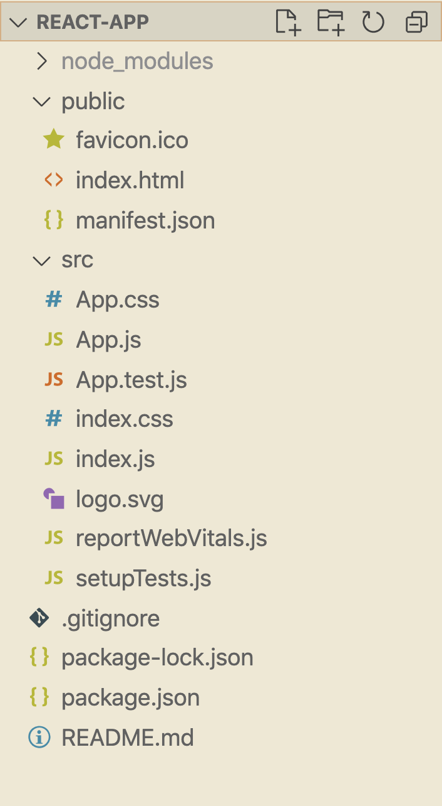

12 Years later...

Open up the project using code lesson or using whichever editor you use, and let's take a look around:

  



  

We already know **`node_modules`**, the HTML file in **public** (ignore the `manifest.json` for now), **`.gitignore`**, **`package.json`**, and the **README.md**

  

So really all that's new is the **src** folder and its contents. Of those, we're really only interested (for now) in **App.js** and **`index.js`**

  

Before we delve into the actual code, **let's run** **npm start*** and see what we have - make sure you're in the `/lesson` directory.
###### *If you check out `package.json` you'll see that under `scripts` we have `react-scripts start` - this is what we're executing when we do npm start - this is what actually starts our react application

  

A few moments after running the command, a new tab should have opened up with a default React page.

Good start - we now know everything is setup properly.

  

Ok, let's look at some files.

### **index.js**

Let's start with the **`index.js`** file. First, a couple of things:

  

-   It is a normal JavaScript file
-   You will likely never change it

  

Except for the `import`s at the top of the file, you should only see this code for now:


```js
const root = ReactDOM.createRoot(document.getElementById('root'));
root.render(
  <React.StrictMode>
    <App />
  </React.StrictMode>
);
reportWebVitals();
```
  

Breaking this down:

  

-   `ReactDOM` gives us high-level methods for operations related to the DOM. 

First we create a `root`
```js
const root = ReactDOM.createRoot(document.getElementById('root'));
```
This will be the container for our React App. All the other components and html element will be placed inside of it.

Next we render the React App:
```js
root.render(
  <React.StrictMode>
    <App />
  </React.StrictMode>
);
```

-   `<React.StrictMode>` - this  is a feature aimed to help us in finding potential problems in an application.
-   `<App />` - this is _what_ we're going to render.
-   Though it looks remarkably similar, **it's not HTML**. It is [JSX](https://reactjs.org/docs/introducing-jsx.html) (a syntax extension to JS which will eventually be used to render HTML) and we'll talk about it properly soon
-   Specifically, it is representing a **component** which we'll also learn about soon
-   `document.getElementById('root')` - this is _where_ we're going to render `<App />`
-   This is plain old vanilla JS. Literally telling it to find something on the DOM with an id of 'root'
-   You can pretty safely ignore the `reportWebVitals()` line, though if you're interested in what it does, [here](https://bit.ly/CRA-vitals) you go.

  
The root we're adding to `<App />` is in your **index.html** file - a file you will, again, not really want to touch.

  

Inside the file, between all the comments, you should see a simple div. This is where everything in our app will render, eventually:

  

```html
<div id="root"></div>
```
  

To drive the point home, change the `ReacDOM.render`... (in **`index.js`**) line from above to this:

  

```js
root.render(
  <React.StrictMode>
    <h1 style={{color:'gold'}}>Hai.</h1>
  </React.StrictMode>
);
```
  

Now save and go back to your browser and look at that - a golden "Hai."

  

Of course, we're not going to be writing our JSX inside of this render function, but now you see exactly what `root.render(...)` does:

  

1.  Take some JSX*
2.  Put it in the element with ID `root`

###### *Behind the scenes, React takes this JSX and uses it to generate HTML. We'll go into that soon.

  

**p.s:** again, JSX is not HTML - it is closer to JS.

Thus, if we wanted to add a `class` attribute to the `h1` above, we would have to use `className` (camelCase) instead, like this:

  

```js
root.render(
  <React.StrictMode>
    <h1 className='goldClass'}>Hai.</h1>
  </React.StrictMode>
);
```
  

This will be true for event handlers as well ( `onClick` instead of `onclick` ), but no need to worry about that right now.

  

**Important:** **reset back to the** **`<App />`** **from before**, and let's check out our next file.

### **App.js**

This is where the React fun begins.

  

Following a few imports, we see a **function** called `App`

```js
function App() {
  return (
    <div className="App">
      <header className="App-header">
        
        <p>
          Edit <code>src/App.js</code> and save to reload.
        </p>
        <a
          className="App-link"
          href="https://reactjs.org"
          target="_blank"
          rel="noopener noreferrer"
        >
          Learn React
        </a>
      </header>
    </div>
  );
}
```
This syntax of react is called **Functional Components** There are also **Class Components**, that have the syntax of a class, you might see some classes code here and there, but we will focus on functional components, that are the recommended practice by React.


We can see that `App` is a plain JS function that is exported at the end:

```js
export default App;
```

`App` is an arbitrary name, but good practice.
This is one example of why we often say that React is very close to its JS roots - it uses plain JS, no magic here.

  

We'll talk about components soon enough, but let's see what we do inside of a component:

  

```js
function App() {
  return (/*some JSX*/)
}
```
  

The only thing the function is doing is returning some JSX. 


You can do whatever you want inside of `function` - it's a normal method after all, **but it must return only JSX!**

  

**Note:** you can return as much JSX as you want _but_ it must all be encompassed within one tag (a `div`, `li`, any)

**Another note:** generally, we wrap our returned JSX in parentheses to avoid issues with [automatic semicolon insertion](http://www.bradoncode.com/blog/2015/08/26/javascript-semi-colon-insertion/).

  

Try it yourself. Change some stuff in there. Remove the logo. Play with the text. Add some inline-css (using the style property as with the `root.render(...)` example above) - you should see all the changes appear on the page each time your save your file!

  

You will notice that once you save your file, the browser will update _automatically_ - this is called **hot reloading** - a nice feature we get with our c`reate-react-app` setup.

  

Ok, let's get to some actual code now.
