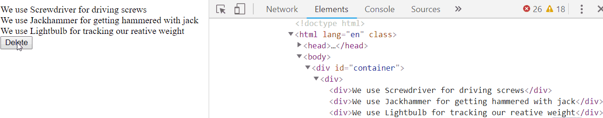

## Intro

Can you smell it? It's the aroma of a chemical _react_ion about to unload a whole new programming paradigm.

  

It's time for **REACT**

  

React is - quite simply - a **JS library for building User Interfaces**. It is a great tool for building **SPA**s* (**S**ingle **P**age **A**pplications).

|||important
## SPA In short

An SPA just means that the app re-writes the current page with new data whenever a change is made, as opposed to always asking the sever for a new page (new HTML). You can read more about SPAs [here](https://blog.pshrmn.com/how-single-page-applications-work/).

|||

So far, any time we wanted to display/update information on our webpage (i.e. building our UI), we've used **jQuery**.

  

Except for lots of things, there's nothing really wrong with jQuery. However, as you've probably noticed by now, it can become a mess to manage when your project grows.

  

And so The Great and Powerful Facebook has created React [and open-sourced](https://reactjs.org/blog/2013/06/05/why-react.html) it for our use. Amen.

  

As with any new tech, we _always_ recommend checking out [the docs](https://reactjs.org/), but let's explore ourselves for a bit.

## **Why React?**

If React is just for UI, and we already know jQuery & Handlebars like a rabbit knows alfalfa sprouts, then why bother with it at all?

  

React is an extremely **popular library** that is used throughout the industry.

You can read about some of the benefits [here](https://www.telerik.com/blogs/5-benefits-of-reactjs-to-brighten-a-cloudy-day), but one of the most powerful benefits is **React's speed**.

  

When we worked with jQuery and proper data flow, **we always re-rendered our _entire_ page's data**.

  

While our data-flow was good, if you look at the DOM as something changes, it looks like this:

Notice that all the `div`s have to re-render whenever we delete _one_ element.

  

We may not notice any performance issues on small-scale apps, but once our apps become bigger, then re-rendering everything isn't as feasible.

  

Even just conceptually it makes sense to only update _the thing that changed_, rather than change _everything_.
