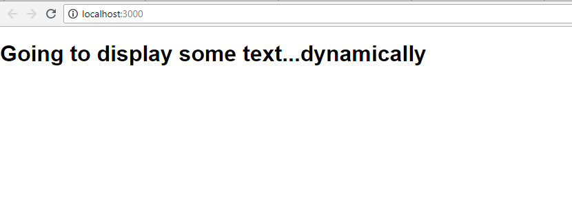

It might look strange and contrary to our notion of **separation of concerns** that we are mixing "HTML" and JS. However,

  

1.  It's not HTML, it's JSX
1.  It is actually easier to have it all in the same file, instead of switching between the HTML and JS files.
1. We're still separating **concerns**, but we're doing it with separate **_components_** instead of separate files.

  

**JSX** stands for **J**ava**S**cript **X**ML - and as we mentioned earlier, it is an extension to JS.

  

This extension allows us to write what _looks_ like HTML (but isn't), alongside regular JS.

  

When we write JSX, React will use that to create **React elements**, which are descriptions of where you want to see your data appear on the DOM. React will then read these elements (which are plain objects) and use them to create the DOM for us, and keep it up to date (we'll see how that works later).

  

One of the main benefits of JSX is that, unlike jQuery/handlebars, **we don't have to "chase" our DOM in order to create/update it**. When we use JS to work with our DOM, we can be certain that the logic we write will apply directly to the parts of the DOM that are relevant.


Check out this example (**use the following code** inside of `App.js`):

  

COPY
```js
import './App.css';

function App() {
  let text = 'dynamically'
  return (
    <div className="App">
      <h1>Going to display some text...{text}</h1>
    </div>
  );
}

export default App;
```
  

Don't worry too much about what a `Component` is yet, but look at what the above code produces:

  

  

Holy wack unlyrical lyrics Andre, you're reacting right!

  

We did a few things here.

  

-   Define a `text` parameter
-   Insert `text` (our data) _as part of_ our JSX, exactly where we want it to appear on the DOM
	-   In this case, we want it in between the `h1` tags
-   **Wrap text variable with curly braces** `{ }`
	-   This is JSX's way of **identifying JS expressions**
	-   We could put any valid JS expression in these braces - operations, function calls, whatever

  

**Note:** we **cannot** have logic such as if-statements or for-loops inside of JSX. We **can** have logic like ternary operators and array methods, which we'll see later on.

  

This is much better than the old jQuery/Handlebar days - or worse, actually doing something like `document.getElemenById("..").innerHTML = ....`

Ha - new age!
